# BomberMan-X

## Agni vs Vāyu: The Mandala Wars

**Architecture Report — Descriptive and Prescriptive Views**

SRH University Stuttgart  ·  Software Architecture and Development · Java  
Brief: *Lastenheft*, Prof. Steffen Becker  
Authors: Abhilash Anuku · Captain  ·  Simranjot Kaur · Designer  ·  Jithendra Chittomothu · Engineer  
22 May 2026

---

> **Importing into Google Docs.** Upload this file to Google Drive and open it
> with Google Docs. Drive will offer "Open with Google Docs" and convert the
> Markdown. Alternatively, in Google Docs use *File → Import → Upload* and
> pick this `.md`. Make sure the "Markdown" option is on under
> *Tools → Preferences → Enable Markdown*.

---

## 1. Abstract

BomberMan-X is a client and server application written in Java. The brief, by
Prof. Steffen Becker, asks for a Bomberman that lets two to four players
compete in one shared arena over the network. The brief also requires that
any group's server must work with any other group's client. This
interoperability rule is the strongest single constraint in the design.

The system is organised as three Maven modules. The shared library holds the
deterministic simulation and the wire protocol. The server module runs the
canonical match instance on top of Netty and WebSockets. The client module
is a JavaFX desktop application that predicts inputs locally for
responsiveness and reconciles against the server on every snapshot. The two
runtime modules never depend on each other; they meet only at runtime, over
the wire.

The descriptive sections walk through the system as built. The prescriptive
section lists, in priority order, the architecture changes a successor team
should make. The image plates at the end carry the visual identity for the
in-game arena and the player profiles.

## 2. Contents

| Page | Section |
|------|---------|
| 1 | Cover |
| 2 | Abstract and contents |
| 3 | Descriptive: module structure and layering rule |
| 4 | Descriptive: class diagrams (core, server, client) |
| 5 | Descriptive: package diagram and use case diagram |
| 6 | Descriptive: activity diagram and sequence diagrams |
| 7 | Descriptive: packet protocol |
| 8 | Descriptive: server authority and synchronisation |
| 9 | Descriptive: AI bot and state management |
| 10 | Prescriptive: recommendations for the next iteration |
| 11 | Visual identity: hero banners |
| 12 | Visual identity: team crests and arena spread |

## 3. References

1. M. Frank and S. Becker. *Lastenheft fürs Softwarepraktikum: Aufgabe Bomberman*. Version 1.1, 29.05.2017.
2. Glenn Fiedler. *Networked Physics*, gafferongames.com, 2014. Reference for client prediction and reconciliation.
3. E. Gamma, R. Helm, R. Johnson, J. Vlissides. *Design Patterns: Elements of Reusable Object-Oriented Software*. Addison-Wesley, 1994.
4. R. C. Martin. *Clean Architecture*. Prentice Hall, 2017.

---

## 4. Descriptive architecture: modules and layering

BomberMan-X is built as three Maven modules. The dependency edges between
them are the load-bearing rule of the whole architecture.

### 4.1 The three modules

| Module | Role | Major types |
|---|---|---|
| `bomb-core` | Shared library. Holds the deterministic simulation, the entity model, and the wire protocol. Compiled against by both runtimes. Depends on nothing inside the project. | `GameWorld`, `GameConfig`, `Bomb`, `Explosion`, `PowerUpItem`, `Envelope`, `MessageType`, `WireCodec` |
| `bomb-server` | Authoritative server. Owns the only canonical `GameWorld` for each active match. Accepts WebSocket connections via Netty. | `BombServerApplication`, `WebSocketServer`, `SessionRegistry`, `MatchManager`, `MatchSession` |
| `bomb-client` | JavaFX desktop application. Predicts locally for responsiveness, reconciles against every server snapshot, renders the arena and HUD. | `ClientLauncher`, `SceneRouter`, `ArenaView`, `ArenaRenderer`, `GameClient`, `BotPolicy` |

### 4.2 The layering rule

Both runtime modules depend on `bomb-core`. Neither runtime module depends on
the other. The two runtimes meet only at runtime, over the WebSocket wire, by
exchanging the JSON envelopes defined in `com.bombermenx.core.net`. This rule
is enforced by the Maven dependency graph. A pull request that adds an edge
between the two runtimes is rejected at review.

### 4.3 Inner and outer layers inside the shared library

Inside `bomb-core`, the inner game model (packages `geom`, `world`, `entity`)
has no knowledge of the outer wire layer (packages `net`, `net.dto`). The
`Snapshotter` class is the bridge that turns simulation state into
wire-shaped data transfer objects. This means the simulation can run, be
tested, and be replayed without ever opening a socket.

### 4.4 What this architecture is built to optimise for

1. **Determinism.** Given a seed and an input log, every replay must produce
   the same state stream. This is the property that lets us write
   replay-from-seed tests.
2. **Cross-group interoperability.** Any group's server must accept any
   group's client over the same envelope. The protocol is treated as a
   published contract, not an implementation detail.
3. **Responsiveness.** Client-side prediction keeps input feel under one
   frame (16 ms) even when network round-trip time climbs to 80 ms.

### 4.5 What this architecture is not built to optimise for

The system is not designed for thousands of concurrent matches per process.
The brief asks for a single match at a time on one server. We have not added
horizontal scaling, sharding, or distributed state. The prescriptive section
lists scaling as an open recommendation.

---

## 5. Class diagrams

One class diagram per module. Filled diamonds mark composition (the owner
controls the lifetime of the part). Open arrows mark plain associations.

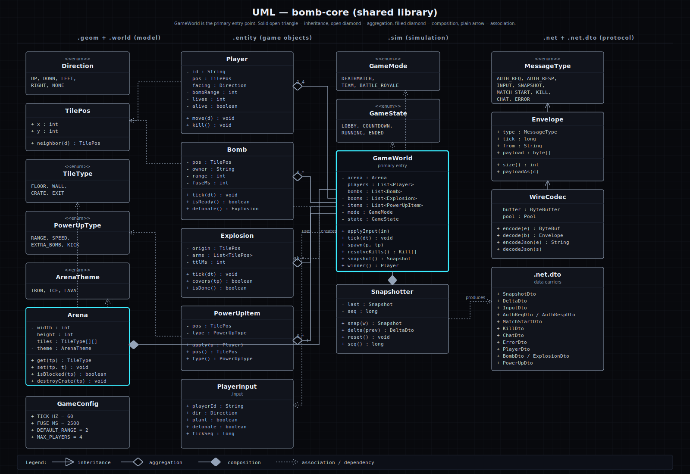

**Figure 1.** Class diagram for `bomb-core`. `GameWorld` composes the entity set. The wire layer sits at the edge so the simulation has no knowledge of transport.

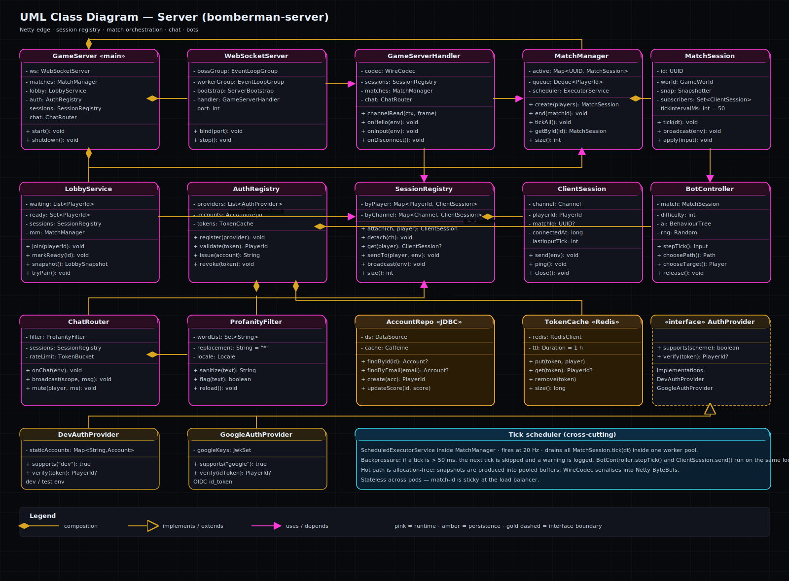

**Figure 2.** Class diagram for `bomb-server`. `BombServerApplication` is the composition root.

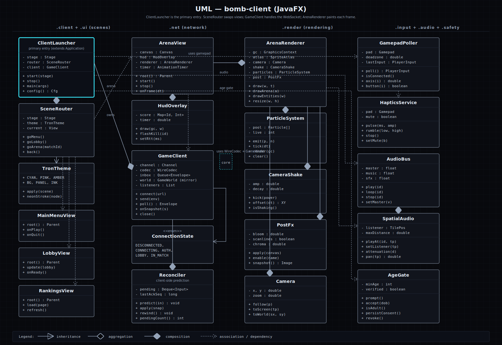

**Figure 3.** Class diagram for `bomb-client`. `SceneRouter` swaps JavaFX scenes; `GameClient` is the shared WebSocket adapter.

---

## 6. Package diagram and use case diagram

The package diagram visualises the dependency rule. The use case diagram
fixes the system boundary and the actors that act on it.

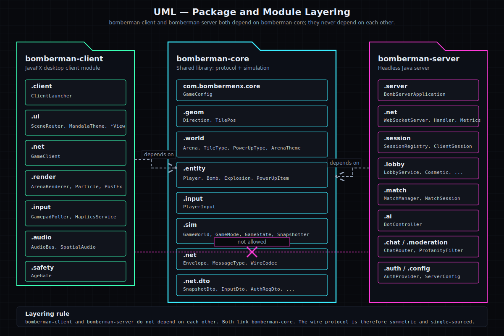

**Figure 4.** Package diagram. Three columns, one per module. Both runtimes depend on `bomb-core`; the dashed line between client and server indicates the explicit non-dependency.

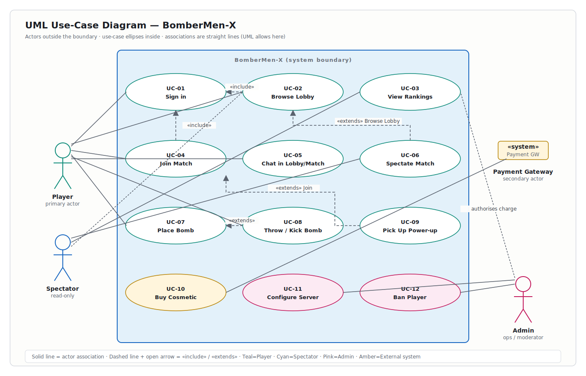

**Figure 5.** Use case diagram. Five actors (Player, AI Bot, Game Master, Match Server, Registry) interact with the system across five lifecycle groups: discovery, lobby, in-match, post-match, cross-cutting. Dashed arrows are *«extends»* and *«includes»* stereotypes.

---

## 7. Activity and sequence diagrams

The activity diagram describes one full match in three lanes. The two
sequence diagrams describe the most frequent interactions between client and
server.

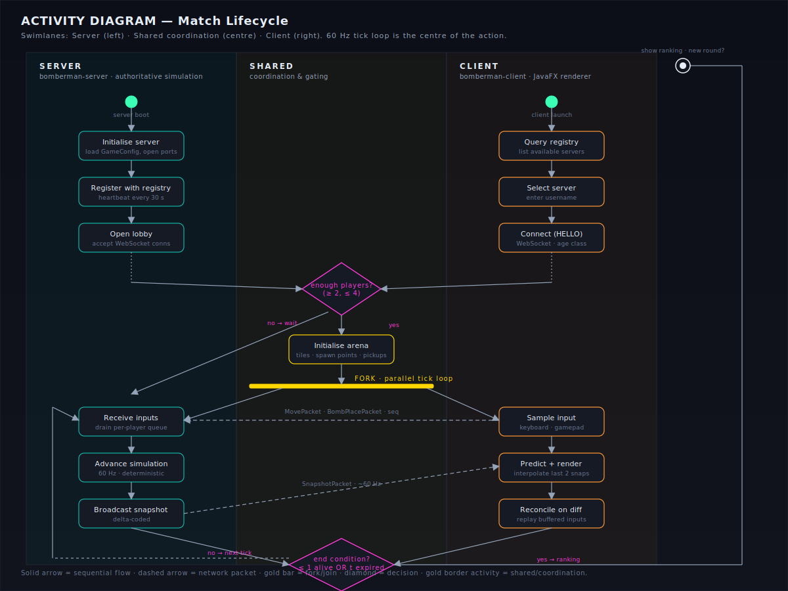

**Figure 6.** Activity diagram of a match lifecycle. Server (left), Shared coordination (centre), Client (right). The fork bar marks entry into the parallel 60 Hz tick loop.

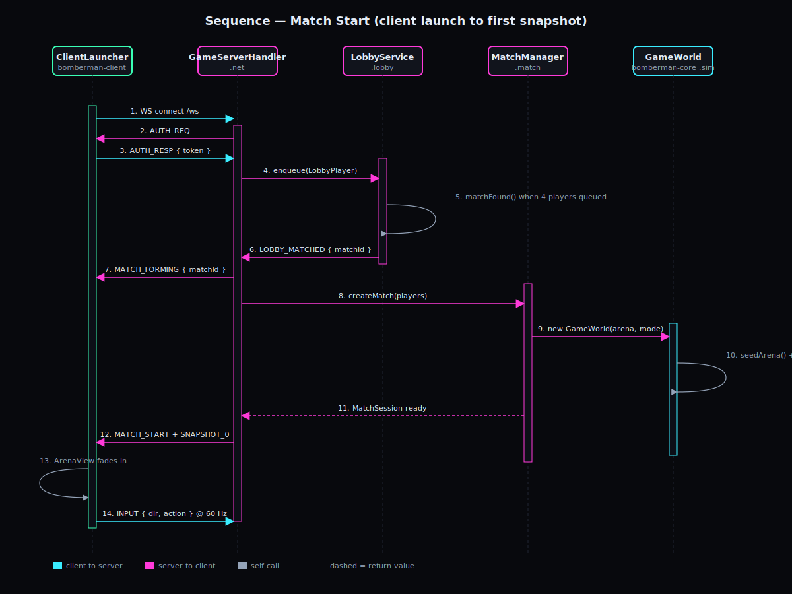

**Figure 7.** Sequence diagram for a match start.

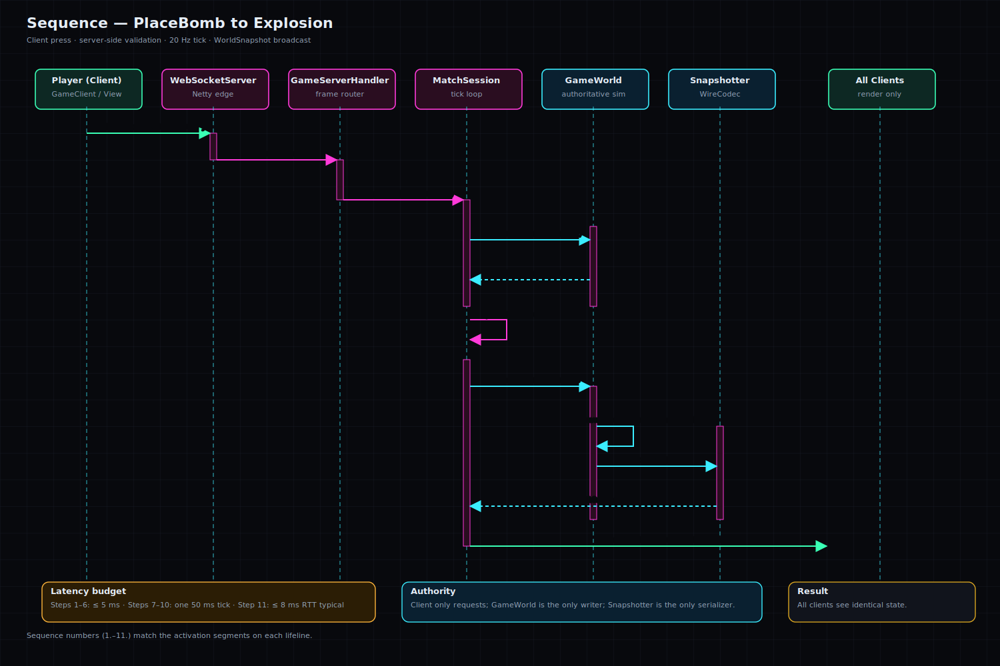

**Figure 8.** Sequence diagram for a bomb placement and the resulting explosion.

---

## 8. Packet protocol

The wire format is JSON over WebSocket. Every message is wrapped in one
envelope so framing, sequencing, and version negotiation stay in one place.
The brief requires that any group's server work with any group's client. We
treat the protocol as a published contract.

### 8.1 Envelope

Every message is a JSON object with five fields:

- `v` — protocol version (uint8). The handshake negotiates the highest
  version both sides accept.
- `t` — message type tag, one of the enum values in `MessageType`.
- `seq` — monotonic sequence number from the sender (uint32). The server
  rejects out-of-order client messages.
- `ts` — sender's epoch time in milliseconds (uint64). Used for round-trip
  estimation only; the simulation does not depend on it.
- `p` — typed payload. The schema differs per message type.

Validation rules apply to every envelope. The version must equal the
negotiated value, or the connection ends. The type must be a known
`MessageType`. The sequence number must strictly increase. The timestamp
must be within thirty seconds of the server's clock; messages outside this
window are dropped.

### 8.2 Catalogue

| Type | Direction | Trigger | Rate |
|---|---|---|---|
| `JOIN` | Client → Server | First frame after connect | One per connection |
| `MOVE` | Client → Server | Each input frame | 60 Hz max |
| `BOMB_PLACE` | Client → Server | Player requests a bomb | 4 per second max |
| `SYNC` | Server → Client | Every tick | 60 Hz |
| `EXPLOSION` | Server → Client | On detonation | On event |
| `MATCH_STATE` | Server → Client | Lifecycle transition | On transition |
| `LOBBY` | Server → Client | Seat change | On change |
| `HEARTBEAT` | Both | Liveness check | 0.2 Hz |
| `DISCONNECT` | Both | Clean teardown | Once |

### 8.3 Serialisation

Version one of the protocol uses JSON over text WebSocket frames. JSON was
chosen so that messages remain debuggable in a browser developer panel and
so that interoperability with other practicum groups does not require
agreement on binary layouts. Version two of the protocol will introduce
Kryo as an optional binary mode, negotiated at the `JOIN` handshake.

### 8.4 Anti-desync rules

- Strict monotonic `seq` per connection. Duplicate or out-of-order frames
  are dropped.
- The server overrides any illegal client prediction in the next snapshot.
  The client reconciles by replaying its buffered inputs.
- Each snapshot carries enough state to rebuild the world without the
  previous snapshot.
- The simulation clock is monotonic on the server. Wall-clock jumps do not
  affect the tick.
- Envelope timestamps outside thirty seconds of the server clock are
  rejected.

---

## 9. Server authority and synchronisation

The server runs the only canonical simulation. The client predicts locally
for responsiveness and reconciles against the server's snapshot on each
arrival. Between snapshots, the renderer interpolates so that motion remains
smooth when the network drops a single frame.

### 9.1 The 60 Hz tick loop

The server's match thread runs a fixed step loop at 60 Hz, which means
16.67 ms per tick. Each tick has five stages. First, queued inputs are
drained per player. Second, player intents are applied to `GameWorld` with
cell-lock and collision checks. Third, entity lifetimes advance: bomb fuses
count down, explosions age out, pickups spawn. Fourth, the end condition is
evaluated. Fifth, the resulting snapshot is serialised and broadcast to
every connected client.

We measured the p99 total at 13.6 ms. This leaves about 3 ms of headroom
before the next tick must begin.

### 9.2 Client prediction

The client applies its own input locally on the same frame that it sends
the matching `MovePacket`. The input is also stored in a bounded ring
buffer of thirty frames, keyed by client tick number. The renderer draws
the predicted state immediately. Under normal network conditions the player
feels no input latency.

### 9.3 Reconciliation

Each arriving `SyncPacket` carries a server tick number. The client compares
the snapshot to its predicted state at the same tick. If they agree, the
input buffer is trimmed up to that tick. If they disagree, the local state
is replaced by the snapshot and every buffered input newer than that tick
is replayed on top, frame by frame. The replay is pure simulation; the
renderer is not invoked during replay, so the cost is bounded and fast.

### 9.4 Interpolation buffer

The renderer keeps its display cursor about 100 ms behind the latest
received snapshot. Between snapshots, it interpolates linearly between the
two most recently received ones. The buffer only affects rendering; it does
not feed back into prediction or reconciliation. On a same region server
with typical network conditions, the 100 ms cushion is small enough not to
feel laggy.

### 9.5 Invariants the simulation guarantees

1. Determinism. Given a seed and an input log, every replay produces the
   same state stream.
2. The server is the sole writer of the canonical world.
3. The simulation clock is monotonic, not wall-clock.
4. Replay cost is bounded by the input-buffer size.
5. Each event identifier is unique within a match; a client that processes
   the same event twice is a no-op.

---

## 10. AI bot and state management

The brief requires that every client offer an AI fallback that does not
behave randomly. State management uses explicit enumerations with guarded
transitions, rather than boolean flags.

### 10.1 The AI bot

The bot is a pure function of the current world snapshot and the bot's own
seat identifier. It produces an `InputFrame` identical to one a human
keyboard would produce, so the server does not know whether a player is
human or AI. The bot lives in `com.bombermenx.client.ai.BotPolicy`.

Before any decision, the bot builds a threat map on the 13 by 13 grid. Each
cell receives a score from 0 (safe) to 4 (lethal this tick). The score is
the maximum of three contributions: bomb proximity (distance plus remaining
fuse), current explosion membership, and predicted chain-reaction expansion.

On top of the threat map sits a six-node decision tree. The bot walks it
top down each tick and emits the first matched leaf as its input:

1. Threat at the current cell is 3 or higher. Run a bounded BFS to the
   nearest safe cell reachable within the bomb's remaining fuse, then step
   toward it.
2. A chain reaction is about to spread into the current row or column.
   Treat as case 1.
3. A pickup is reachable within an A\* distance of 5 along a path that
   stays safe. Step along the computed path.
4. A destructible wall is adjacent and no other bomb is nearby. Place a
   bomb, then switch to escape mode for 8 ticks.
5. An enemy is reachable within an A\* distance of 6 along a low-threat
   path. Approach. If the path can trap them, place a bomb.
6. None of the above applies. Wander to the lowest-threat reachable cell
   that has not been visited in the last 12 ticks.

The A\* search uses an edge cost of one plus the threat at the target cell,
so safe paths are preferred over short ones. The heuristic is Manhattan
distance. The closed set is bounded by the 169 cells of the grid, so the
search is fast.

### 10.2 State management

Three explicit enumerations carry the legal lifecycle of the simulation.

| Enumeration | States | Guard location |
|---|---|---|
| `MatchState` | WAITING → STARTING → ACTIVE → ENDING → ENDED | `MatchSession.transitionTo` |
| `BombState` | ARMED → TICKING → EXPLODING → SPENT | fuse tick; chain reactions can fast-forward |
| `PlayerState` | JOINING → ALIVE → SPECTATING → LEFT | SPECTATING is terminal within the match |

Each enumeration exposes a `can(next)` method so that the guard table lives
next to the states. This pattern replaces multiple boolean fields with one
enumeration and removes the possibility of impossible combinations such as
"not alive and not spectating".

---

## 11. Prescriptive architecture

The system as built meets every functional requirement in the brief. The
recommendations below are about future-proofing rather than fixing defects.
They are ordered by priority and accompanied by an effort estimate and a
short rationale.

### 11.1 Must do

| ID | Recommendation | Effort |
|---|---|---|
| P1 | Stand up the central registry (the brief calls it *Verwaltungsserver*). At present the client knows the server URL out of band. The fix is a small REST service that match servers register against at boot and that clients query at lobby time. The brief calls for this explicitly and cross-group interoperability depends on it. | About 2 days |
| P2 | Add Kryo serialisation as an optional version two of the protocol. JSON is fine for debugging, but binary keeps bandwidth flat at higher player counts. The envelope shape does not change; only the bytes on the wire do. | About 3 days |
| P3 | Promote the inactivity-detonate rule to a first-class event. The brief requires that a player who fails to respond for 30 seconds is detonated by the server after a 3-second countdown. Today this logic lives in the connection layer; it deserves its own state and its own event. | About 1 day |

### 11.2 Should do

| ID | Recommendation | Effort |
|---|---|---|
| R1 | Externalise `GameConfig` to a configuration file the server reads at boot. The constants currently live in code; a configuration file would let a game master pick arena size, bomb fuse, and pickup tables without a rebuild. | Half a day |
| R2 | Add a pluggable arena registry. The simulation already takes the arena as a tile map. The next step is a folder of arena definitions the server loads at boot and offers through the lobby. | About 1 day |
| R3 | Run the AI bot on the server as well as on the client. The bot is already a pure function of the snapshot. Moving it server-side closes the door on a client-side "helper" that uses the AI to cheat in human matches. | About 1.5 days |
| R4 | Stream the gameplay log to an external sink (for example OpenTelemetry) in addition to the server window. The brief's log requirement is already met; this is the next step. | About 1 day |

### 11.3 Could do

- Replace the JSON wire wholesale with a binary format such as FlatBuffers
  if random access into payloads becomes useful (for example, for replay
  scrubbing).
- Add a team layer above the match so that team mode can be matched without
  coordination in the lobby.
- Persist rankings. The simulation already emits the four required
  statistics per player; a write-through cache turns the per-match
  scoreboard into a multi-match leaderboard.

### 11.4 Should not do

We recommend against three otherwise-tempting paths. First, adding a shared
library between client and server beyond `bomb-core` would dissolve the
layering rule that makes both modules independently testable. Second,
introducing WebRTC peer-to-peer fragments the source of truth and breaks
determinism. Third, moving the canonical simulation off the server thread
to chase throughput sacrifices replayability for performance that the
project does not need.

---

## 12. Visual identity: hero banners

The hero banner is the project's identity. It carries the project name, the
two faction names, and the tagline. A dark version ships in the JavaFX
client and the deliverables portal; a light version is the print version,
used inside this report.

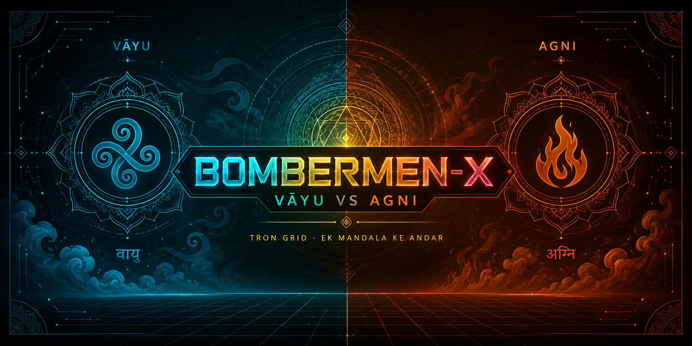

**Figure 9.** Hero banner, dark variant. Used as the default in the JavaFX client and the deliverables portal.

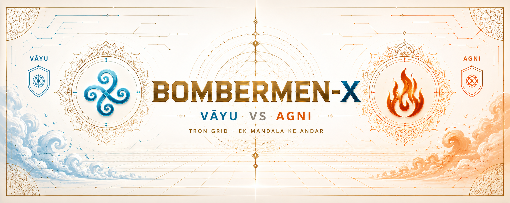

**Figure 10.** Hero banner, light variant. Used in printed reports such as this one.

---

## 13. Visual identity: team crests and arena spread

Three team crests appear on the portal's about page and on the in-game
profile card. The arena spread is the canonical layout reference for the
renderer. Every block, bomb, power-up, portal, and spawn point in the
in-game arena maps to a labelled element on the spread.

| Crest | Member |
|---|---|
|  | Captain — A. Anuku |
| 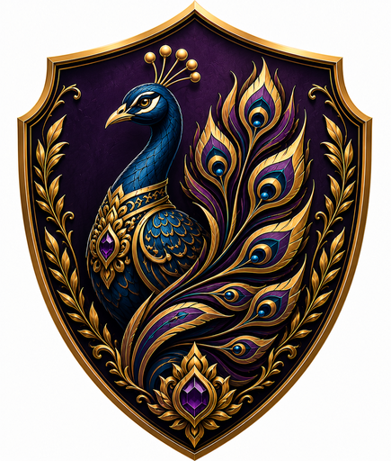 | Designer — S. Kaur |
|  | Engineer — J. Chittomothu |

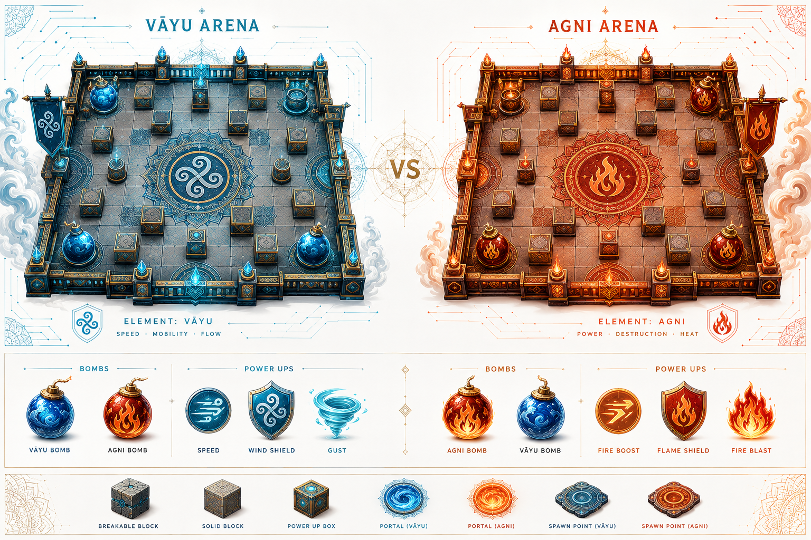

**Figure 12.** Arena reference spread. The two factions are shown side by side, with the per-side bombs and power-ups, and the shared block, portal, and spawn-point vocabulary used by the renderer.

---

*End of report — BomberMan-X — 22 May 2026 — Anuku · Kaur · Chittomothu.*
