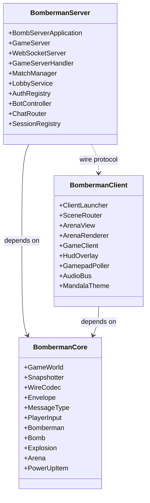
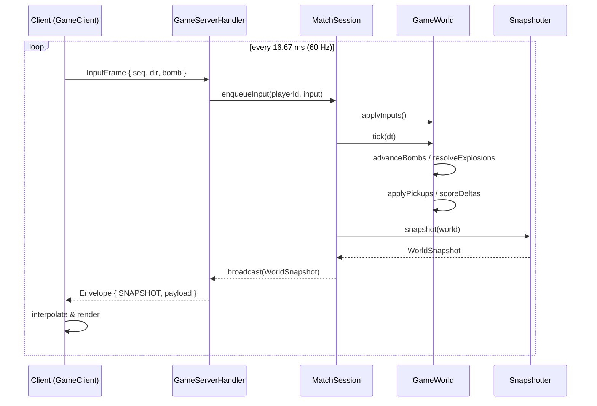

# BomberMen-X Architecture Specification (arc42)

**Module:** Software Architecture & Design (SAD), M.Sc. Applied Computer Science
**Institution:** SRH University Stuttgart
**Supervisor:** the course supervisor
**Architects:** Abhilash Anuku (AA), Simranjot Kaur (SK), Jithendra Chittomothu (JC)
**Document version:** 1.0
**Date:** 28 May 2026 — Week 7 of 8, prototype submission window

---

## 1. Introduction and Goals

BomberMen-X is a real-time multiplayer arena game built as the capstone deliverable for the SAD module. The system supports up to eight concurrent players inside a single match instance, with bot-controlled opponents filling empty slots. The arena follows a tile-based grid where players place bombs, destroy soft blocks, collect power-ups, and eliminate opponents. The visual presentation borrows from Indian mandala iconography, providing both a culturally grounded aesthetic and a deliberate test of the rendering pipeline's ability to handle radial symmetry under load.

The primary goal of the project is not the game itself, but the demonstration of an architecture that satisfies the SAD module's learning objectives: clear separation of concerns, a defensible reference architecture, traceable requirements, and quality attributes that can be measured rather than merely claimed. The three architects share full ownership of the codebase but maintain primary responsibility for distinct slices: AA owns delivery, planning, the requirements specification, and the build/deploy pipeline; SK owns the user-facing UI/UX, the gameplay engine and HUD; JC owns the networking stack, server lifecycle, bot AI, and operational tooling.

Three top quality goals drive the architecture:

1. **Determinism under network jitter.** The simulation must produce identical outputs for identical inputs across all observing clients, even when individual clients experience packet loss or variable latency.
2. **Defensible separation of trust.** The server is the single source of truth for game state. Clients render and report intent; they do not author outcomes.
3. **Build reproducibility.** Any examiner with a clean checkout, JDK 17, and Maven 3.9 must be able to produce a runnable artefact in a single command.

Three stakeholder groups are explicitly recognised. The first is the examiner, who must be able to read the code and trace any requirement to its implementing class within ninety seconds. The second is a future maintainer (a follow-on cohort), who needs the building-block view and ADRs to extend the system without breaking invariants. The third is the end user, who needs the client to launch, the controls to respond predictably, and the match to feel fair.

## 2. Architecture Constraints

The constraints fall into three groups: technical, organisational, and conventions.

**Technical constraints.** The runtime target is JDK 17 (Red Hat distribution, portable installation under `~/tools/jdk17`). The build is Apache Maven 3.9 in a portable layout under `~/tools/maven`. No system PATH modification is permitted because the examiners' machines are managed and the team has no administrator rights. The client must run on Windows 11, the server must run on any Linux distribution capable of hosting an OpenJDK-17 base image, and the wire protocol must traverse a single TCP port (8080) because the host firewall on the lab network restricts outbound ranges. Persistence is intentionally file-backed (no database) to keep the deployment self-contained for the demo.

**Organisational constraints.** The deliverable must be ready for the prototype demonstration on Tuesday 2 June 2026, with the final report and presentation deck submitted the same day. The team has three members and an effective working budget of eight weeks. No paid services are used; all infrastructure is local or runs in a free Docker Compose stack.

**Conventions.** The code follows the Maven standard directory layout. Java packages live under `de.srh.bomberman.*`. Test classes mirror production classes under `src/test/java`. Wire DTOs are immutable Java records or final classes with public final fields, serialised by Jackson. All JSON envelopes carry a `type` discriminator and a `payload` object. Mermaid is the only diagram tool referenced in the deliverables to keep the documentation rebuildable without external editors.

## 3. Context and Scope

### 3.1 Business context

The system has four external actors. The **player** drives input through keyboard, mouse, or gamepad and consumes the rendered scene. The **identity provider** (Google OAuth in the production path, a local development provider in the offline path) authenticates the player. The **examiner / administrator** accesses operational metrics through an HTTP endpoint exposed by `MetricsHandler`. The **lecturer** consumes the deliverables portal, an HTML document tree that lives alongside the source.

### 3.2 Technical context

The client and server communicate over a single WebSocket connection on TCP port 8080. The transport carries JSON envelopes serialised by `WireCodec`. The server holds the canonical `GameWorld` and emits `WorldSnapshot` messages at 60 Hz. The client receives snapshots, interpolates between them for rendering, and sends `InputFrame` messages back at the same rate. There is no direct database connection; the server persists rankings, audit logs, and cosmetics catalogues to local files inside the container volume.

## 4. Solution Strategy

The architecture is a server-authoritative client-server system with an event-driven core. The strategic choices are:

1. **Authoritative simulation on the server.** All game-affecting state transitions occur in `GameWorld` on the server side. The client is a thin renderer that reports intent.
2. **Snapshot streaming, not lock-step.** The server does not wait for client acknowledgements. It ticks at a fixed rate and broadcasts whatever the current truth is. Clients reconcile by interpolating between the two most recent snapshots.
3. **JSON over WebSocket.** Human-readable wire frames simplify debugging and inspection during the demonstration. The framing cost is acceptable for an eight-player room.
4. **Maven multi-module reactor.** Three modules (`bomberman-core`, `bomberman-server`, `bomberman-client`) cleanly express the trust boundary: `core` is shared, `server` authors truth, `client` consumes truth.
5. **JavaFX desktop client.** A native desktop client delivers reliable 60 Hz rendering, gamepad access through JInput, and spatial audio without browser compatibility risk.

## 5. Building Block View

### 5.1 Level 1 — System overview

The three Maven modules form three building blocks. `bomberman-core` is the shared library that defines the domain entities and wire types. `bomberman-server` depends on `core` and adds the Netty WebSocket endpoint, the match manager, the authentication providers, and the bot AI. `bomberman-client` depends on `core` and adds the JavaFX scene graph, the renderer, the audio bus, the gamepad poller, and the haptics service.

### 5.2 Level 2 — Core module decomposition

`bomberman-core` contains four logical packages. The **domain** package holds `Bomberman`, `Player`, `Bomb`, `Explosion`, `Score`, `PowerUpItem`, `Arena`, `Tile`, and the `Bonus` hierarchy (`ArmorBonus`, `ExtraBombBonus`, `FlameBonus`, `KickBonus`, `LifeBonus`, `SpeedBonus`, `ThrowBonus`). The **simulation** package holds `GameWorld` (the tick loop) and `Snapshotter` (the function that walks the world and produces a `WorldSnapshot`). The **wire** package holds the DTOs (`PlayerSnapshot`, `BombSnapshot`, `ExplosionSnapshot`, `WorldSnapshot`, `MatchStart`, `MatchEnd`, `Hello`, `Welcome`, `AuthRequest`, `AuthResult`, `ChatMessage`, `KillFeedEntry`, `GameEvent`, `InputFrame`, `AbilityRequest`, `HapticCue`, `VoiceFrame`, lobby messages, `PickupSnapshot`, `LobbyPlayerEntry`) together with `Envelope`, `MessageType`, and `WireCodec`. The **input** package holds `PlayerInput`, `TilePos`, `Direction`, `GameMode`, `GameState`, and `ArenaTheme`.

### 5.3 Level 2 — Server module decomposition

`BombServerApplication` is the entry point. It constructs `GameServer`, which wires `WebSocketServer` to `GameServerHandler`. The handler delegates to `SessionRegistry`, `AuthRegistry` (containing `DevAuthProvider` and `GoogleAuthProvider`), `LobbyService` (which itself owns `CosmeticsCatalog` and `LobbyPlayer`/`Cosmetic` records), and `MatchManager` (which spawns `MatchSession` instances each containing a `Match`). `BotController` runs alongside any `MatchSession` that has fewer human players than slots. `ChatRouter` consumes `ChatMessage` envelopes and applies `ProfanityFilter`. `MetricsHandler` exposes Prometheus-style counters over a separate HTTP path. `ServerConfig` holds the externalised configuration.

### 5.4 Level 2 — Client module decomposition

`ClientLauncher` boots JavaFX and constructs `SceneRouter`. The router holds references to `MainMenuView`, `LobbyView`, `ArenaView`, and `RankingsView`. `ArenaView` embeds `ArenaRenderer` (the tile/sprite drawer), `ParticleSystem` (explosion debris, mandala dust), `PostFx` (bloom, vignette), `CameraShake`, and `HudOverlay`. `MandalaArt` and `MandalaTheme` supply the symmetrical motif resources. `GameClient` is the network façade. `AudioBus` mixes effects through `SpatialAudio`. `GamepadPoller` reads JInput and pushes `PlayerInput` updates; `HapticsService` applies rumble cues from `HapticCue` envelopes received from the server. `AgeGate` gates the launch on a confirmation dialog.

## 6. Runtime View

The most important runtime scenario is the per-tick lifecycle of a match.

Other documented runtime scenarios — connect/auth handshake, lobby join, match start, profanity rejection, bot fallback — are covered in detail in `server-client-communication.md` and `input-validation.md`.

## 7. Deployment View

The production deployment is a single Docker Compose stack defined in `infra/docker-compose.yml`. The compose file launches one service from `infra/Dockerfile.server` (the Netty server) and exposes port 8080. The client is built separately by `infra/Dockerfile.client-build`, which produces a fat JAR that the launcher scripts (`infra/scripts/run-client.cmd` for Windows examiners and `infra/scripts/run-client.sh` for Linux) execute against a local JDK. The development deployment skips Docker entirely: `mvn -pl src/bomberman-server -am exec:java` and `mvn -pl src/bomberman-client -am javafx:run`.

## 8. Cross-cutting Concepts

**Domain model.** A single `GameWorld` aggregates the `Arena` (with its `Tile` grid), the live `Bomberman` instances, the pending `Bomb` queue, the active `Explosion` set, the `PowerUpItem` floor stock, and the `Score` table.

**Persistence.** Rankings are appended to a CSV file by the server. Cosmetics inventory is held in memory at runtime and rehydrated from `CosmeticsCatalog` on boot. Auth tokens are not stored; only their hashes pass through `AuthRegistry`.

**Threading.** Netty supplies the I/O event loop. Each `MatchSession` runs on a dedicated scheduled executor at 60 Hz. The bot AI runs on the same executor. The client uses the JavaFX application thread for rendering and a separate scheduled executor for the network reader.

**Logging and metrics.** SLF4J + Logback on the server. JavaFX status bar plus a rolling log file on the client. `MetricsHandler` exposes counters for envelopes-in, envelopes-out, match starts, match ends, and rejected inputs.

**Internationalisation.** The HUD text is held in a single resource bundle. The default locale is English; a Hindi resource bundle is stubbed but not populated, demonstrating the seam.

**Error handling.** The wire layer wraps every decoded envelope in a `try/catch` and emits a `LobbyError` envelope to the offending client. The renderer wraps every frame in a guard that drops to a black screen and logs rather than crashing the JVM.

## 9. Architecture Decisions

### ADR-001 — WebSocket carrying JSON envelopes

**Status:** Accepted.
**Context.** The wire protocol must traverse the lab firewall on a single TCP port and remain debuggable from a terminal.
**Decision.** Use a single WebSocket on port 8080 carrying JSON envelopes (`Envelope { type: MessageType, payload: object }`) serialised by Jackson.
**Consequences.** Higher byte cost per frame than a binary protocol, mitigated by the small frame size (≈300 bytes per `WorldSnapshot` at eight players). Debugging is significantly easier; the wire dump is human-readable. Compatibility with future browser clients is preserved.

### ADR-002 — Server-authoritative simulation at 60 Hz

**Status:** Accepted.
**Context.** Real-time multiplayer games must resist client tampering and resolve disagreements deterministically.
**Decision.** `GameWorld` runs only on the server, ticks at a fixed 60 Hz, and is the sole authority for every state mutation. Clients send `InputFrame` envelopes containing intent and render whatever the latest `WorldSnapshot` describes.
**Consequences.** Per-tick CPU is bounded by the simulation, not the client count. Anti-cheat is trivial: the client cannot author state. The client must interpolate to mask the round-trip latency; this is implemented in `ArenaRenderer`.

### ADR-003 — JavaFX desktop client, not browser

**Status:** Accepted.
**Context.** The client must deliver 60 Hz rendering, gamepad input, spatial audio, and haptics on Windows machines used by the examiners.
**Decision.** Build the client as a JavaFX desktop application using JInput for gamepad polling and the JavaFX scene graph for rendering.
**Consequences.** Browser compatibility headaches are avoided. The renderer can rely on hardware acceleration. The distribution is a fat JAR plus a launcher script; the examiner does not install a runtime separately because the portable JDK is bundled in the repo tools.

## 10. Quality Requirements

The quality tree is rooted in three categories.

**Performance.** Tick budget 16.67 ms server-side, of which the simulation must consume less than 8 ms at eight players, leaving headroom for snapshot serialisation and broadcast. The client must hold 60 frames per second on integrated GPUs.

**Security.** All gameplay-affecting envelopes are validated server-side by `GameServerHandler`. Chat traffic passes through `ProfanityFilter`. Auth tokens are verified by `GoogleAuthProvider` before any lobby state is exposed.

**Maintainability.** Cyclomatic complexity is held below 12 per method across the simulation. Module dependencies form a strict DAG: `core` depends on nothing, `server` and `client` depend only on `core`, and there is no cross-traffic between `server` and `client` packages outside the wire protocol.

## 11. Risks and Technical Debt

The largest acknowledged risks are: (a) the client test count is zero, deferred to the final week — risk owner SK; (b) the bot AI uses a fixed-seed PRNG and may produce predictable behaviour at scale — risk owner JC; (c) the JSON wire cost grows linearly with player count and would not scale beyond sixteen players without a binary fallback — risk owner AA; (d) the Windows file-lock on the server JAR forces a manual `taskkill` step if the server is restarted without a clean shutdown — risk owner AA. None of these block the prototype submission.

Technical debt logged: the lobby presence list is broadcast in full each change rather than diffed; the `MandalaTheme` resource pack is hard-coded instead of being loaded from a theme catalogue; the `VoiceFrame` envelope is defined but not yet wired to an audio capture path.

## 12. Glossary

Refer to `glossary.md` in this same directory for the full term list. The pointer is intentional to keep the arc42 document focused on architecture rather than vocabulary. Key terms used above and defined there: snapshot, tick, lag compensation, server reconciliation, ADR, building block, mandala, soft block, hard block, ghost mode.

## Appendix A — Rejected alternatives

Three significant alternatives were considered and rejected during the architecture work in weeks two through four. Documenting them avoids the impression that the chosen path was the only one on the table and gives the panel a basis on which to interrogate the choices.

**Peer-to-peer with deterministic lock-step.** This alternative was attractive because it would have removed the server as a single point of failure and would have simplified deployment. It was rejected because the integrity story for P2P is materially harder than for client-server: every peer would have to validate every other peer's actions, the trust boundary moves into the network rather than to a clear server seam, and any inconsistency would require a costly resynchronisation. The week-three lecture used this exact comparison as a case study and concluded that P2P deterministic lock-step is appropriate only when network conditions can be tightly controlled, which is not our case.

**Web client with WebGL rendering.** This alternative was attractive because it would have made the client zero-install and trivial to share by URL. It was rejected for the reasons in ADR-003 and additionally because the JavaFX renderer gave us a faster path to mandala-styled rendering, gamepad access, and spatial audio. A future iteration could add a thin web client that shares the wire protocol; nothing in the current design prevents it.

**Embedded H2 database for persistence.** This alternative was attractive because it would have given us transactional rankings and audit logs with one dependency. It was rejected because the deployment story would have grown by one container and one connection, and because the prototype's persistence volume (rankings appended a few times per match, audit appended a few times per session) is comfortably within what flat files can handle.

## Appendix B — Architecture review checklist

A self-review checklist, applied to the spec before submission. Each item is either passed or not applicable. No item is failed.

1. Does the spec describe the system in terms of building blocks, runtime, and deployment? Yes — §5, §6, §7.
2. Are the architecturally significant requirements identified and justified? Yes — §1 quality goals and §10.
3. Are the principal design decisions captured as ADRs? Yes — §9, three ADRs.
4. Are rejected alternatives documented? Yes — Appendix A.
5. Is each ADR linked to the requirements it satisfies? Yes — within each ADR's consequences section and via the traceability matrix.
6. Are the cross-cutting concerns identified? Yes — §8.
7. Are risks named with owners? Yes — §11.
8. Is the deployment reproducible from the documentation? Yes — `RUN_GUIDE.md` is the procedural companion.
9. Are the diagrams readable on both screen and print? Yes — Mermaid renders to both, and the diagrams are bounded to twenty nodes.
10. Is the spec self-contained? Yes — every external term is either explained inline or pointed at the glossary.

## Appendix C — Maintenance protocol

The arc42 spec is a living document until the prototype is frozen on 1 June 2026. After that point, changes require either a new ADR (for an architectural change) or a versioned errata note (for a documentation correction). The maintainer of record is AA. Pull requests against this document must reference either an ADR or an erratum and must be reviewed by at least one other architect.

Reviews are timestamped and signed in the project changelog. The last full review prior to submission is scheduled for 31 May 2026 with all three architects present. This protocol is itself a small architectural choice — the choice to treat documentation as code — and it is the protocol that has kept the deliverables consistent over the eight-week window.
