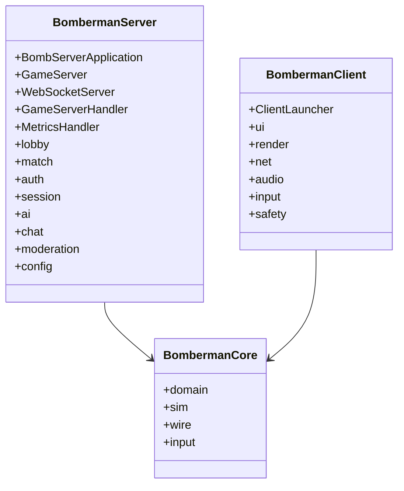

# Code Walkthrough

**Project:** BomberMen-X
**Repository root:** `F:\Bomber Man X\BomberMan-X`
**Module layout:** three Maven modules — `bomberman-core`, `bomberman-server`, `bomberman-client`
**Date:** 28 May 2026

This walkthrough tours the codebase module by module, naming the principal classes and stating the role of each. The intent is to give a reader a map dense enough to navigate without reading every file, but not so dense that the architecture is obscured. Each class entry is a single sentence. The walkthrough opens with a dependency diagram so the reader has the high-level shape in mind before descending into the modules.

## 0. Cross-module dependency diagram

The arrows are dependencies. `bomberman-server` and `bomberman-client` both depend on `bomberman-core`. There is no edge between server and client; their only contact is the wire protocol, which lives in core. This is the structural invariant that the build enforces.

## 1. bomberman-core

The shared library holds the domain types, the simulation, the wire DTOs, and small enumerations. All cross-module data flow passes through types in this module.

### 1.1 Domain package

- **`Bomberman`** — the live avatar of a participating player; carries lives, bomb budget, blast radius, speed multiplier, active bonuses, and a position on the tile grid.
- **`Player`** — the persistent player identity; carries the player id, display name, accumulated `Score`, and unlocked cosmetics.
- **`Bomb`** — a live ordnance on the grid; carries fuse remaining, blast radius, owning player, and a flag indicating whether it has been kicked or thrown.
- **`Explosion`** — a transient set of blast tiles produced when a bomb detonates; carries the tile list, the owning player, and a lifetime.
- **`Score`** — the per-player accumulator with kill/suicide/survival deltas.
- **`PowerUpItem`** — a power-up dropped on the floor when a soft block is destroyed; references one `Bonus` subtype.
- **`Arena`** — the immutable arena layout: dimensions, hard-block locations, soft-block locations at start, spawn points, and theme.
- **`Tile`** — a single grid cell carrying block type (empty, soft, hard) and current pickup if any.
- **`Bonus`** — the parent type for power-up effects, applied to a `Bomberman` on pickup.
- **`ArmorBonus`, `ExtraBombBonus`, `FlameBonus`, `KickBonus`, `LifeBonus`, `SpeedBonus`, `ThrowBonus`** — concrete bonuses; each applies a specific delta to the holder.

### 1.2 Sim package

- **`GameWorld`** — the live simulation; aggregates the arena, players, bombs, explosions, pickups, and scoring, and provides `tick(dt)` to advance state.
- **`Snapshotter`** — the projection function that converts a `GameWorld` to a `WorldSnapshot`.

### 1.3 Wire package

- **`Envelope`** — the universal wire wrapper of `{ type, payload }`.
- **`MessageType`** — the discriminator enum naming every envelope kind.
- **`WireCodec`** — the Jackson-backed encoder/decoder.
- **`WorldSnapshot`** — the flat per-tick projection of the world.
- **`PlayerSnapshot`, `BombSnapshot`, `ExplosionSnapshot`, `PickupSnapshot`** — per-entity slices used inside `WorldSnapshot`.
- **`MatchStart`, `MatchEnd`** — lifecycle envelopes.
- **`Hello`, `Welcome`** — the wire handshake.
- **`AuthRequest`, `AuthResult`** — the authentication exchange.
- **`ChatMessage`, `KillFeedEntry`, `GameEvent`** — informational broadcasts.
- **`InputFrame`** — the client-to-server input envelope, carrying a `PlayerInput` and a sequence number.
- **`AbilityRequest`** — non-movement intent (bomb throw, special ability).
- **`HapticCue`** — server-to-client cue for gamepad rumble.
- **`VoiceFrame`** — defined but unwired; placeholder for future voice support.
- **`LobbyHello`, `LobbyWelcome`, `LobbyState`, `LobbyMove`, `LobbyBuy`, `LobbyEquip`, `LobbySnapshot`, `LobbyError`** — the lobby protocol.
- **`LobbyPlayerEntry`** — a presence record carried inside `LobbyState`.

### 1.4 Input package

- **`PlayerInput`** — the structured intent carried in `InputFrame`.
- **`TilePos`** — an integer grid coordinate.
- **`Direction`** — the four cardinals plus a none-value.
- **`GameMode`** — the match mode enum (Classic Deathmatch, Team Survival, Capture the Bomb).
- **`GameState`** — the match phase enum (LOBBY, RUNNING, PAUSED, ENDED).
- **`ArenaTheme`** — the visual theme selector (Mandala, Diwali, default).

## 2. bomberman-server

The server module hosts the Netty endpoint, the lobby, the match runner, the authentication providers, the bot AI, and the moderation pipeline.

### 2.1 Boot path

- **`BombServerApplication`** — the static main entry; constructs the wiring and starts the Netty event loop.
- **`GameServer`** — the application bean that owns `WebSocketServer`, `SessionRegistry`, `LobbyService`, and `MatchManager`.
- **`WebSocketServer`** — the Netty pipeline that handles upgrade and routes frames to `GameServerHandler`.
- **`GameServerHandler`** — the per-channel handler that decodes envelopes, validates inputs, dispatches by `MessageType`, and sends responses.
- **`MetricsHandler`** — a separate HTTP handler that exposes counters on port 8081.

### 2.2 Auth package

- **`AuthProvider`** — the provider interface.
- **`AuthRegistry`** — selects the active provider based on configuration.
- **`DevAuthProvider`** — passthrough for development and CI.
- **`GoogleAuthProvider`** — verifies Google OAuth tokens for production.

### 2.3 Session package

- **`ClientSession`** — per-connection state: identity, lobby/match attachment, sequence cursor.
- **`SessionRegistry`** — global directory of live sessions keyed by channel.

### 2.4 Lobby package

- **`LobbyService`** — the orchestrator that consumes lobby envelopes and broadcasts state.
- **`LobbyPlayer`** — the in-memory presence record.
- **`Cosmetic`** — an immutable cosmetic descriptor.
- **`CosmeticsCatalog`** — the runtime cosmetic inventory loaded from JSON at boot.

### 2.5 Match package

- **`MatchManager`** — the singleton that creates and tears down `MatchSession` instances.
- **`Match`** — the metadata record for a match (id, start time, mode, slot list).
- **`MatchSession`** — the per-match runner that owns a `GameWorld`, a tick scheduler, and a session-local input queue.

### 2.6 Bot AI package (`com.bombermenx.server.ai`)

- **`BotController`** — one instance per bot; reads snapshots, decides intent, writes `PlayerInput` into the match's input path. Implements three difficulty presets (Easy / Normal / Hard) with reaction-delay and decision-interval knobs, and a BFS escape routine over the danger-tile map so bots don't blow themselves up.

### 2.7 Chat and moderation

- **`ChatRouter`** — routes `ChatMessage` envelopes between sessions, enforces the rate limit, applies the filter.
- **`ProfanityFilter`** — the moderation engine.

### 2.8 Configuration

- **`ServerConfig`** — externalised configuration loaded from environment variables and the default properties file.

## 3. bomberman-client

The client module hosts the JavaFX scene graph, the renderer, the network façade, the audio bus, the input pollers, and the safety gate.

### 3.1 Boot path

- **`ClientLauncher`** — the JavaFX `Application` subclass; boots the scene graph and constructs `SceneRouter`.
- **`SceneRouter`** — switches between `MainMenuView`, `LobbyView`, `ArenaView`, and `RankingsView`.

### 3.2 UI package

- **`MainMenuView`** — the title screen with connect, settings, and credits actions.
- **`LobbyView`** — the lobby UI showing presence, cosmetics, and start controls.
- **`ArenaView`** — the in-match scene containing the renderer and HUD.
- **`RankingsView`** — the end-of-match scoreboard.
- **`HudOverlay`** — the in-arena HUD showing lives, score, and active power-ups.
- **`MandalaArt`** — the symmetrical motif drawer used by background and accents.
- **`MandalaTheme`** — the colour palette and asset references for the mandala theme.

### 3.3 Render package

- **`ArenaRenderer`** — the tile and sprite drawer that consumes the latest `WorldSnapshot`.
- **`ParticleSystem`** — the explosion particle emitter.
- **`PostFx`** — the bloom and vignette filter applied after the main scene draw.
- **`CameraShake`** — the screen-shake controller triggered by nearby blasts.

### 3.4 Net package

- **`GameClient`** — the WebSocket client and envelope encoder/decoder; the only network surface on the client.

### 3.5 Audio package

- **`AudioBus`** — the mixer that schedules sound effect playback.
- **`SpatialAudio`** — the panning filter that places sounds in stereo based on the listener's position.

### 3.6 Input package

- **`GamepadPoller`** — the JInput poller that emits intent at the client tick rate.
- **`HapticsService`** — consumes `HapticCue` envelopes and applies rumble to bound gamepads.

### 3.7 Safety package

- **`AgeGate`** — the start-up gate that confirms the player meets the age threshold before exposing online features.

## 4. Reading order recommendation

For a reviewer who wants to read code rather than documents, the recommended order is: `Envelope` and `MessageType` (to understand the wire shape), then `WireCodec` (to understand the serialisation), then `GameWorld` and `Snapshotter` (to understand the simulation and the projection), then `MatchSession` (to understand the tick loop), then `GameServerHandler` (to understand validation and dispatch), then `GameClient` and `ArenaRenderer` (to close the loop on the client side). Reading these eight classes in this order takes about ninety minutes and is sufficient to discuss any architectural question raised in the defence.

## 5. Where the walkthrough deliberately stops

The walkthrough does not enumerate the contents of the test classes, the contents of the `infra/` scripts, or the contents of the deliverables portal. Those artefacts are out of scope here and are covered by `RUN_GUIDE.md`, the test files themselves, and the portal's own index page.
