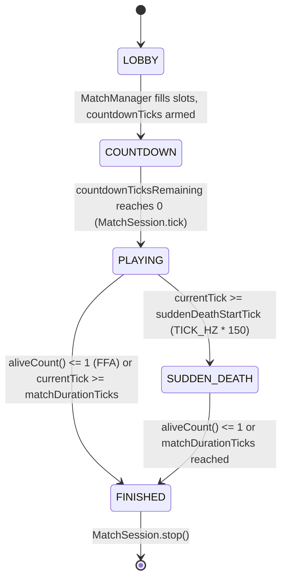
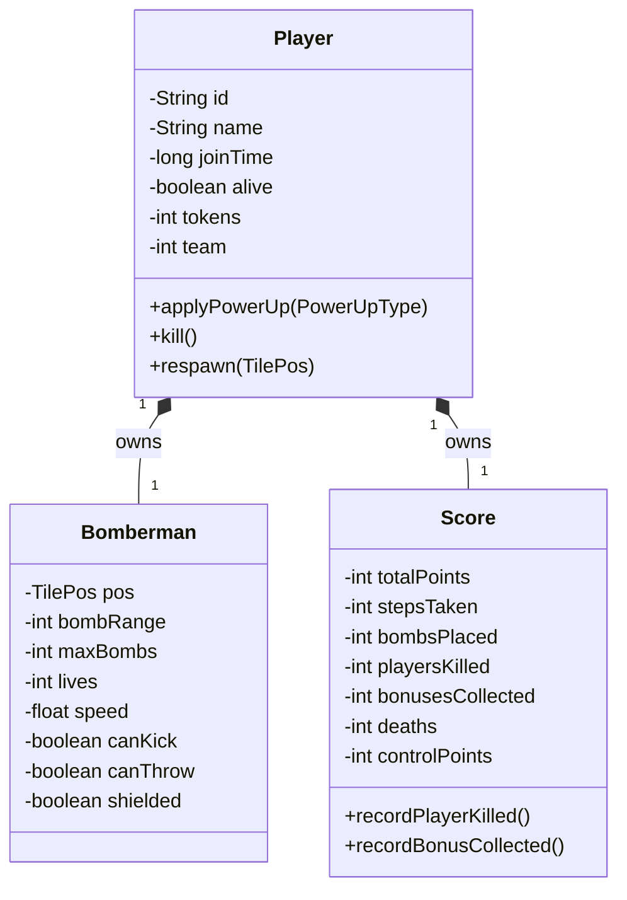
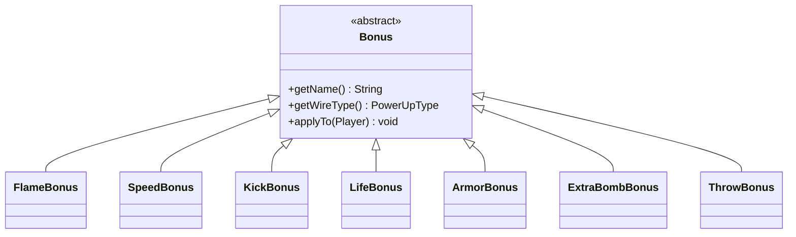
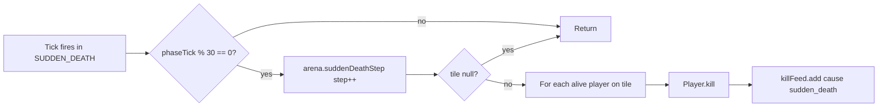

# BomberMen-X — Game Design

**Date:** 28 May 2026 · Week 7 of 8 — Prototype
**Module:** Software Architecture and Development — M.Sc. Applied Computer Science, SRH University Stuttgart
**Examiner:** Prof. Dr. Floriment Klinaku
**Authors:** Abhilash Anuku (AA — delivery, spec), Simranjot Kaur (SK — UI/UX, gameplay engine), Jithendra Chittomothu (JC — networking, deploy, bot AI)

---

## 1. Premise and lineage

BomberMen-X is a server-authoritative, deterministic, grid-arena competitive game in which two to eight bombermen detonate timed ordnance on a tiled board, the goal being last alive (or, in alternative modes, highest control score). The gameplay ancestor is Hudson Soft's *Bomberman* line, in particular *Super Bomberman* (Hudson Soft / Nintendo, 1993), whose four-player split-screen lattice arenas formalised the conventions BomberMen-X reuses: an outer indestructible frame, an interior lattice of solid pillars on even coordinates, soft destructible blocks at variable density, four-direction explosion rays terminated by the first solid or destructible tile, and capacity/range upgrades dropped probabilistically from destroyed soft walls.

The thematic layer is a *Vāyu* (cool, air, blue/cyan) versus *Agni* (warm, fire, amber/red) Indian mandala duel. Mandala symmetry is reflected mechanically — `Arena.spawnCorners(int n)` is rotationally symmetric for every n ∈ {2..8}. Theme art is owned by SK; spec, domain model, and delivery by AA; transport, deployment, and bot AI by JC. The system is Java 17 across three Maven modules under `src/`: `bomberman-core` (simulation, entities, DTOs), `bomberman-server` (match orchestration, WebSocket transport, bot driver), `bomberman-client` (Swing/AWT renderer, audio, input).

## 2. Match lifecycle states

The lifecycle is encoded by `GameState` (`src/bomberman-core/src/main/java/com/bombermenx/core/sim/GameState.java`) with values `LOBBY`, `COUNTDOWN`, `PLAYING`, `SUDDEN_DEATH`, `FINISHED`. Transitions are driven by `MatchSession.tick()` (`src/bomberman-server/src/main/java/com/bombermenx/server/match/MatchSession.java`) and `GameWorld.tick()` (`src/bomberman-core/src/main/java/com/bombermenx/core/sim/GameWorld.java`). `GameWorld` advances physics only in `PLAYING` or `SUDDEN_DEATH`; otherwise `tick()` increments the clock and returns.



Countdown is `BX_COUNTDOWN_SECONDS` (default 5) via `ServerConfig`. Sudden death begins at 150 s (9000 ticks at 60 Hz); match cap is 180 s (`matchDurationTicks = TICK_HZ * 180`).

## 3. Game modes

`GameMode` (`src/bomberman-core/src/main/java/com/bombermenx/core/sim/GameMode.java`) carries the four rule overlays. The core simulation is mode-agnostic; rule branches in `GameWorld.tick()` apply end-of-match conditions.

**FFA.** Every Bomberman is hostile to every other. Win: `aliveCount() <= 1` or the timer expires (highest `Score.getTotalPoints()` then wins). Formula: `100 * playersKilled + 25 * bonusesCollected`.

**KING_OF_GRID.** A central energy node teleports every 20 s (`KING_NODE_TELEPORT_TICKS = 20 * TICK_HZ`). The player on the node accrues one control point per second. Win: first to `KING_SCORE_TARGET = 30` or highest `controlPoints` at the cap. Kills still award +100 to `totalPoints` but do not trigger victory.

**LEVELS.** Single-player progression. Arena dimensions scale via `Arena.dimensionsForLevel(playerCount, level)` — each cleared level adds 2 width + 2 height, capped 31×21, kept odd so pillars line up. Each new level adds one bot. Win: defeat all bots; failure resets to the same level.

**TEAMS.** 4v4 with friendly fire disabled. `Player.team` is 0 (RED) or 1 (BLUE); the friendly-fire short-circuit in `GameWorld.detonate(b)` skips damage when both team ids match and are ≥ 0. Win: `teamsAliveCount() <= 1` or timer expires. Formula: same as FFA, summed per team.

## 4. Arena

`Arena` (`src/bomberman-core/src/main/java/com/bombermenx/core/world/Arena.java`) is a mutable, flat-indexed tile grid sized rows × columns, top-left origin, +x right, +y down. `TileType` defines three classes — `FLOOR` (walkable), `SOLID` (indestructible pillar, forms the frame and interior lattice), `DESTRUCTIBLE` (soft wall, cleared by one ray). Walkability and destructibility are constructor parameters on `TileType`; `TileType.blocksExplosion()` returns true for both `SOLID` and `DESTRUCTIBLE`.

Arena generation is deterministic: `Arena.generate(seed, density, playerCount)` runs four ordered passes — (i) emit the outer SOLID frame plus interior SOLID pillars on even coordinates; (ii) random destructible fill on every interior FLOOR tile at the configured density; (iii) carve a safe FLOOR pocket around every spawn corner (cardinal plus two tiles toward the arena centre); (iv) carve one-tile-wide L-shaped lanes between every adjacent pair of spawns. Pass ordering is load-bearing — (ii) must run before (iii), or the random fill walls the player back in.

Six themes are defined by `ArenaTheme` (`src/bomberman-core/src/main/java/com/bombermenx/core/world/ArenaTheme.java`) — `NEON_GRID` (balanced baseline), `INFERNO` (denser walls, faster fuse, bigger blast), `CRYO_VAULT` (sparse, slow fuse, open duels), `JUNGLE_GRID` (dense destructibles, baseline pacing), `REACTOR_CORE` (sparse, snappy blast, fast bombs), `VOID_MAZE` (medium density, long fuse, smaller blast). Each carries three multipliers — `densityMul`, `fuseMul`, `powerMul` — applied to the engine defaults at world construction. `ArenaTheme.pickRandom(rng)` selects the theme per match.

## 5. Player and Bomberman composition

The domain model separates account identity from in-arena pawn state. `Player` (`src/bomberman-core/src/main/java/com/bombermenx/core/entity/Player.java`) owns exactly one `Bomberman` (in-arena pawn) and exactly one `Score` (per-player counters). The composition is 1-to-1 and immutable — both children are created in the `Player` constructor and never replaced. Public getters on `Player` delegate to `bomberman` and `score` so legacy call sites are unaffected by the split. AA ratified this layout against Dr. Klinaku's domain specification.



`Bomberman.pos` is tile-locked; a position change is only committed once the pawn has crossed a full tile boundary. Sub-tile interpolation for smooth rendering is tracked in `Bomberman.subTileProgress` and surfaced through `Snapshotter`.

## 6. Bomb mechanics

`Bomb` (`src/bomberman-core/src/main/java/com/bombermenx/core/entity/Bomb.java`) carries `id`, `ownerId`, `pos`, `power`, plus mutable `fuseTicks` and `detonated`. Placement occurs in `GameWorld.placeBomb(p)` when the input frame asserts `placeBomb`, `canPlaceBomb()` is true (alive, `activeBombs < maxBombs`), and no bomb already occupies the tile. `power` is `themedPower(p.getBombPower())` and fuse `themedFuseTicks()` — both applying `ArenaTheme` multipliers to `DEFAULT_BOMB_POWER = 3` and `DEFAULT_BOMB_FUSE_TICKS = 150` (2.5 s at 60 Hz).

```mermaid
sequenceDiagram
    participant C as Client (SK)
    participant S as MatchSession (JC)
    participant W as GameWorld
    participant B as Bomb
    C->>S: InputFrame{placeBomb=true, sequence=N}
    S->>W: inputFor(playerId).setPlaceBomb(true)
    W->>W: applyPlayerInputs() — canPlaceBomb? bombAt(pos)?
    W->>B: new Bomb(id, ownerId, pos, power, fuseTicks)
    W->>W: bombs.add(b); p.incrementActiveBombs(); p.recordBombPlaced()
    loop every tick until fuse expires
        W->>B: tickFuse()
        B-->>W: returns true when fuseTicks reaches 0
    end
    W->>W: detonate(b) — emit Explosion + damage players
    W-->>C: WorldSnapshot with new BombSnapshot / ExplosionSnapshot
```

Chain reactions are resolved in `GameWorld.tickBombs()`: every bomb whose fuse just reached zero is added to `primed`; the loop transitively adds any non-primed bomb whose tile is hit by the ray of a primed bomb (`rayHits(p, b.getPos())`). All primed bombs detonate in the same tick.

## 7. Explosion mechanics

`Explosion` (`src/bomberman-core/src/main/java/com/bombermenx/core/entity/Explosion.java`) carries the list of affected `TilePos` plus a lifetime counter (`DEFAULT_EXPLOSION_LIFETIME_TICKS = 36`, or 0.6 s). Propagation is computed in `GameWorld.detonate(b)`: starting at the bomb's tile, four rays travel in each cardinal `Direction` for at most `b.getPower()` steps. A ray terminates at out-of-bounds, at the first `SOLID` (consumed as a stopper but not added to the affected set), or after consuming exactly one `DESTRUCTIBLE` (which is added, converted to `FLOOR`, and offered a pickup drop via `maybeDropPickup(cur)`). Rays are independent.

Damage is applied in the same call: every alive player on an affected tile is killed unless (a) they share a non-negative team id with the bomb owner, or (b) `Bomberman.shielded` is true — `consumeShield()` then discards the shield and the player survives the hit. The killer accrues +100 via `Score.recordPlayerKilled()`.

## 8. Power-ups

`PowerUpType` (`src/bomberman-core/src/main/java/com/bombermenx/core/world/PowerUpType.java`) is the wire-level enum with six values. `GameConfig.POWERUP_DROP_RATE = 0.40f` — each destroyed soft wall has a 40 % chance of spawning a `PowerUpItem`. `Player.applyPowerUp(PowerUpType)` is the single mutation site and is invoked from `GameWorld.collectPickups()` when a living player stands on a pickup.

| `PowerUpType` | Effect on `Bomberman` |
| --- | --- |
| `EXTRA_BOMB` | `bomberman.incrementMaxBombs()` — +1 to `maxBombs` |
| `BOMB_POWER` | `bomberman.incrementBombRange()` — +1 to `bombRange` |
| `SPEED` | `bomberman.increaseSpeed(0.5f, 8.0f)` — +0.5 tiles/s, hard-capped at 8.0 |
| `KICK` | `bomberman.enableKick()` — sets `canKick = true` |
| `THROW` | `bomberman.enableThrow()` — sets `canThrow = true` |
| `SHIELD` | `bomberman.enableShield()` — sets `shielded = true` (single-use) |

Every pickup also advances `Score.recordBonusCollected()`, incrementing `bonusesCollected` and adding 25 to `totalPoints`.

## 9. Bonus hierarchy

The wire-level `PowerUpType` is mirrored at the domain level by the abstract `Bonus` (`src/bomberman-core/src/main/java/com/bombermenx/core/world/Bonus.java`) and seven concrete subclasses. AA introduced the typed hierarchy so the spec's `applyTo(Player)` contract and its scoring side-effect sit on the subclasses rather than being branched in the simulation.



`FlameBonus` carries `BOMB_POWER`, `SpeedBonus` carries `SPEED`, `KickBonus` carries `KICK`, `ArmorBonus` carries `SHIELD`, `ExtraBombBonus` carries `EXTRA_BOMB`, `ThrowBonus` carries `THROW`. `LifeBonus.getWireType()` returns `null` — no LIFE value exists on `PowerUpType` yet, so a LifeBonus cannot be serialised over the wire and is reserved for scripted level rules or test fixtures. The follow-up requires adding a LIFE wire value and an `applyPowerUp` branch.

## 10. Scoring

`Score` (`src/bomberman-core/src/main/java/com/bombermenx/core/entity/Score.java`) owns seven counters — `totalPoints`, `stepsTaken`, `bombsPlaced`, `playersKilled`, `bonusesCollected`, `deaths`, and (KING-only) `controlPoints`. All mutations route through `record*` helpers; direct field access is prohibited.

Point arithmetic is fixed: `recordPlayerKilled()` adds 100, `recordBonusCollected()` adds 25, `recordControlPoint()` adds 1. Mutation sites in `GameWorld`: `detonate(b)` calls `killer.addKill()` (line 497 for explosion kills, line 257 in the nuke-ability path); `collectPickups()` calls `p.applyPowerUp(...)` (line 548), which calls `recordBonusCollected`. Steps are recorded in `applyPlayerInputs()` via `p.recordStep()` whenever a commit moves the pawn to a new tile; placements in `placeBomb()` via `p.recordBombPlaced()`. Deaths are recorded both through `Player.kill() → score.recordDeath()` and explicitly via `p.addDeath()` — a redundancy retained for back-compat.

## 11. Sudden death

When `currentTick` reaches `suddenDeathStartTick` (9000 ticks = 150 s), `GameWorld.tick()` transitions state to `SUDDEN_DEATH`. Thereafter, `advanceSuddenDeath()` triggers `arena.suddenDeathStep(suddenDeathStepsTaken++)` once every 30 ticks — every 0.5 s wall-clock. The remaining 30 s drop at most 60 SOLID walls, enough to collapse the playable area at any supported size.

`Arena.suddenDeathStep(step)` traces an outside-in clockwise spiral: layer 0 walks the perimeter just inside the SOLID frame (top→right→bottom→left), layer 1 is the next inner ring, and so on. Each call converts the next spiral tile to `SOLID` and returns its position (or `null` if it hits an already-SOLID tile or exhausts the playable area). Any living player on the freshly dropped tile is killed via `Player.kill()` and a kill-feed entry tagged `"sudden_death"` is emitted. Shields grant no save here — the comment in `advanceSuddenDeath()` is explicit: "sudden death means sudden death".



## 12. Inputs

Input flows through two structures. `PlayerInput` (`src/bomberman-core/src/main/java/com/bombermenx/core/input/PlayerInput.java`) is the server-side, sampled, mutable view — five fields: `movement: Direction`, `placeBomb: boolean`, `detonateRemote: boolean`, `sequence: long`, `clientTickMs: long`. Inputs are sampled not queued: each tick the simulation reads the latest intent; held movement persists across ticks while `placeBomb` and `detonateRemote` are one-shots cleared by `clearOneShots()`.

The wire payload is the record `InputFrame` (`src/bomberman-core/src/main/java/com/bombermenx/core/net/dto/InputFrame.java`) with the same five fields. The client serialises one `InputFrame` per outbound message via `WireCodec`; the server applies it in `MatchSession.applyInput(...)`. Key bindings (SK) are WASD plus arrow keys for movement and `SPACE` for `placeBomb`; gamepad axes and buttons are captured through JInput and folded into the same `InputFrame` schema.

## 13. Bot AI

`BotController` (`src/bomberman-server/src/main/java/com/bombermenx/server/ai/BotController.java`) is owned by JC. `BotController.beforeTick()` is invoked once per match tick *before* `GameWorld.tick()`, so the bot writes its decided intent into the same `PlayerInput` slot a remote client would.

Three personality profiles are sampled on construction with a 40/40/20 distribution — EASY, NORMAL, HARD. Each fixes five tunables: `reactionDelayTicks` (sticky direction hold before reacting to new danger — 18/12/6), `decisionInterval` (re-think cadence — 12/8/4 ticks), `bombChance` (probability of dropping when line-of-sight exists — 0.55/0.75/0.92), `pauseChance` (probability of pausing on a decision tick — 0.20/0.10/0.04), `wrongDirChance` (probability of a non-optimal direction — 0.18/0.08/0.03).

The algorithm is heuristic and BFS-based — no machine learning. Each decision tick the bot (i) computes `dangerTiles()` by unioning all active explosion tiles with the projected rays of every unfused bomb; (ii) if standing on a danger tile, runs a bounded BFS (budget 64) toward the nearest safe tile and returns the first step direction; (iii) otherwise locates the closest living enemy by Manhattan distance and, if it lies on the same row or column within `bombPower`, probabilistically drops a bomb and steps backward; (iv) failing that, steps toward the closest enemy or random-walks. The "wrong direction" roll fires last so even HARD occasionally fumbles a turn.

---

**End of document.** Subsystem ownership: domain entities, spec, and this deliverable — AA. Render, input, theme art — SK. `MatchSession`, transport, deploy, bot AI — JC.
