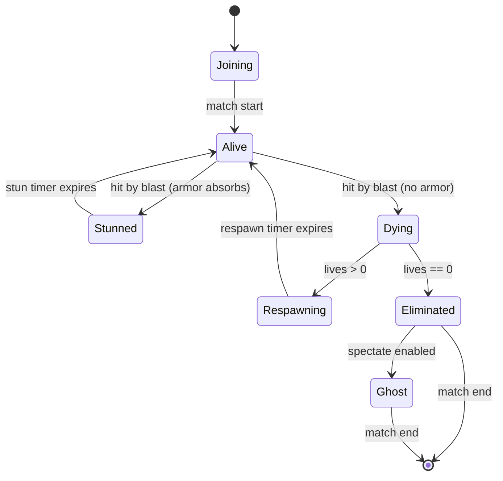
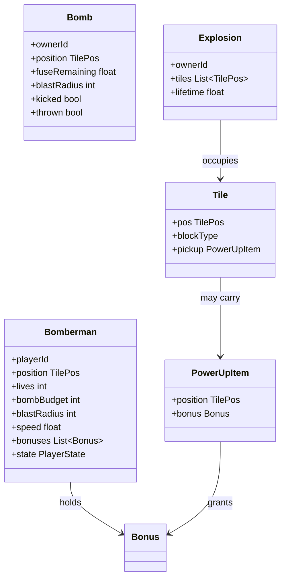
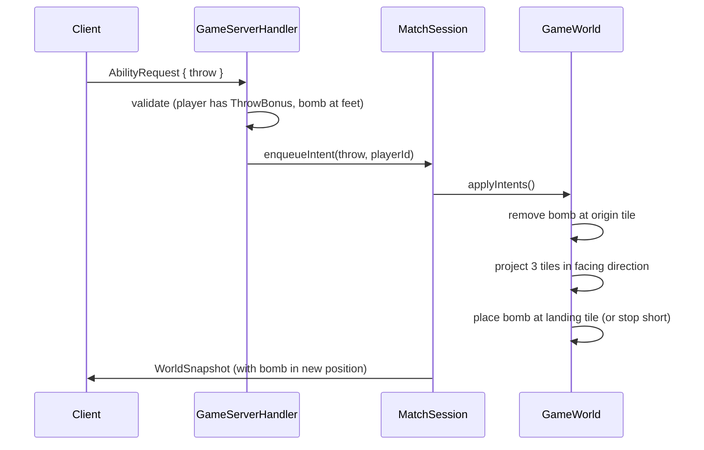
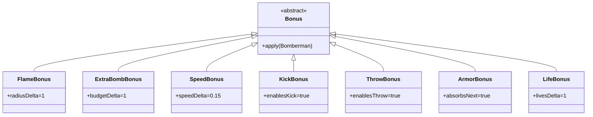
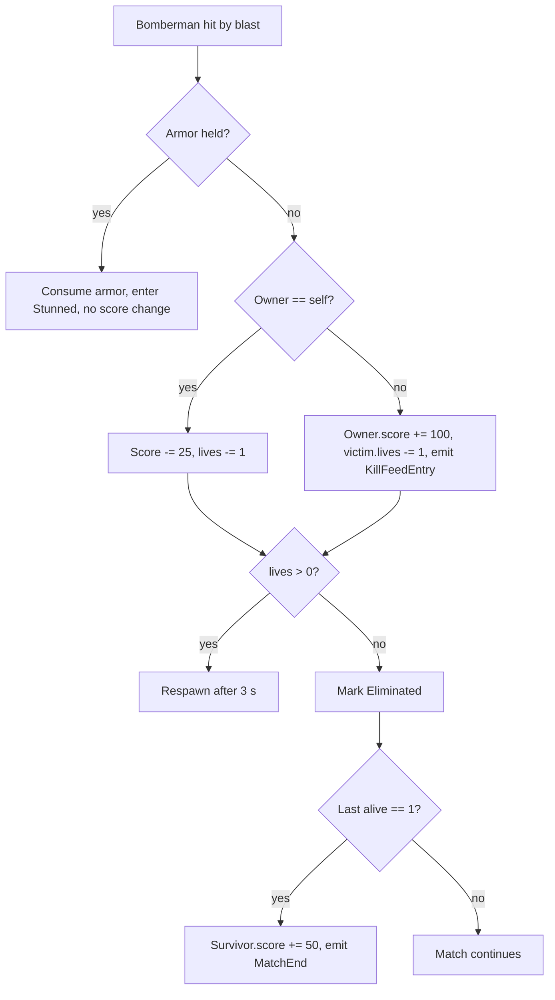

# Game Design

**Project:** BomberMen-X
**Design lead:** Simranjot Kaur (SK)
**Co-authors:** AA (rules formalisation), JC (mode balance)
**Date:** 29 May 2026

This document specifies the rules of BomberMen-X with sufficient precision that the simulation in `GameWorld` can be checked against them. It covers the arena and tile system, player state and lifecycle, bombs and explosions, power-ups, scoring, win conditions, and the three supported match modes. Visual style notes follow the rules; this is intentional because the rules are stable and the visual style is decorative.

## 1. Arena

A match takes place on a single arena described by `Arena`. The arena is a rectangular grid of `Tile` instances, indexed by `TilePos`. The reference dimensions are 13 columns by 11 rows. Tiles take one of three block types: empty, soft, or hard. Hard blocks form a fixed lattice on the even/even coordinates; they cannot be destroyed and they halt explosion propagation. Soft blocks fill a randomised subset of the remaining cells at match start; they are destroyed by any explosion that touches them and may drop a `PowerUpItem`. Empty tiles are walkable and may carry a pickup.

Spawn points sit in the four corners and at the four cardinal midpoints, giving up to eight starting positions. The arena enforces a small no-block radius around each spawn so that no player is killed before their first input. The arena is symmetrical along both axes; this is not strictly required by gameplay but it pairs naturally with the mandala visual theme.

## 2. Player lifecycle

A player goes through the following lifecycle during a match. The transitions are owned by `GameWorld` and reflected in the `WorldSnapshot`.

The state names map to fields on the `Bomberman` instance. `Stunned` is a brief invulnerable interval after an armor absorption; during this window the player cannot place bombs but can move. `Ghost` is the post-elimination spectate state; in the prototype, ghosts can navigate the arena visually but cannot interact and do not appear in any snapshot's player list.

## 3. Core entities

The `Bonus` hierarchy is rendered separately below because it is the most-extended part of the domain and benefits from its own diagram.

## 4. Bombs and explosions

A player with a positive bomb budget may place a `Bomb` on their current tile. The bomb's fuse is 2.5 seconds. On expiry the bomb is replaced by an `Explosion` whose tile set is computed by propagating outward in each of the four cardinal directions up to `blastRadius` tiles, halting at the first hard block or arena edge. Soft blocks halt propagation in their direction but are themselves destroyed. The explosion lifetime is 0.6 seconds, during which any player whose tile overlaps a blast tile takes a hit.

A hit is absorbed by an `ArmorBonus` if held, removing the armor and entering `Stunned` for one second. Otherwise the player enters `Dying`, decrements lives, and either respawns (after 3 seconds at a spawn point with a no-blast guarantee) or transitions to `Eliminated` if lives have reached zero.

Bombs caught in another bomb's blast detonate immediately, producing chain reactions. The chain is resolved within a single tick to keep determinism.

## 5. Kick and throw

When a player holds a `KickBonus` and moves into a tile occupied by a bomb, the bomb slides in the movement direction one tile per tick until it strikes a wall, another bomb, or a player. The mechanic is intentionally short-range; it is a positioning tool, not a projectile.

When a player holds a `ThrowBonus` and issues an `AbilityRequest` envelope with the throw verb, the bomb at their feet is projected three tiles in the facing direction, ignoring soft blocks in flight but stopping at hard blocks and the arena edge. The throw is documented in the sequence diagram below.

## 6. Power-ups

The seven power-ups are subclasses of `Bonus`. A player may hold any combination, up to a per-type cap of six (business rule BR-01).

Power-up drops are seeded at soft-block destruction time. The probability table is:

| Bonus            | Drop probability | Effect when applied                 |
|------------------|------------------|-------------------------------------|
| FlameBonus       | 18 %             | Blast radius +1 tile                |
| ExtraBombBonus   | 18 %             | Bomb budget +1                      |
| SpeedBonus       | 14 %             | Movement speed +15 %                |
| KickBonus        | 8 %              | Enables bomb kick                   |
| ThrowBonus       | 6 %              | Enables bomb throw                  |
| ArmorBonus       | 6 %              | Absorbs next explosion hit          |
| LifeBonus        | 3 %              | Lives +1                            |
| (no drop)        | 27 %             | Soft block destroyed without drop   |

The probabilities sum to 100 %. They were tuned by playtesting in week six to produce roughly one drop per two soft blocks destroyed.

## 7. Scoring

`Score` is updated by `GameWorld` on each gameplay event. The deltas, per FR-50 to FR-55:

- Kill of an enemy: +100 points.
- Survival to the end of a match: +50 points.
- Suicide (caught in own blast): −25 points.
- Environmental death (caught in another bomb's blast that no one owns, e.g., chain at match end): 0 points.

The kill feed (`KillFeedEntry`) is broadcast on every kill, and the final ranking is presented by `RankingsView` after `MatchEnd`.

## 8. Modes

Three modes are supported, selected at match creation via `GameMode`.

**Classic Deathmatch.** Free-for-all, three lives per player. The last survivor wins and earns the survival bonus. Matches end when one player remains or when the twelve-minute hard cap is reached (BR-03), in which case the highest score wins.

**Team Survival.** Two teams of up to four players each. Teammates do not damage each other. The team with at least one surviving member at twelve minutes wins. Each surviving teammate earns the survival bonus.

**Capture the Bomb.** A neutral bomb spawns at the centre tile every thirty seconds. A player who places that bomb in the enemy spawn-area earns 250 points and the bomb respawns at the centre. The first player to 1000 points wins. This mode is the most stress-testing of the throw mechanic.

## 9. Win conditions

A match ends when any of the following becomes true: a single player or team remains alive (Classic or Team Survival); a score threshold is reached (Capture the Bomb); the twelve-minute hard cap is reached (any mode); the host triggers an administrative end. `MatchSession` is responsible for detecting end conditions on each tick and emitting `MatchEnd` accordingly.

## 10. Visual style — mandala theme

The default theme is the mandala motif. `MandalaArt` draws radially symmetric backgrounds with eight-fold symmetry, echoing the eight player slots. The colour palette is anchored on saffron, deep magenta, and indigo, with accents in turmeric yellow and henna brown. `ParticleSystem` emits petal-shaped particles on explosions, biased toward the palette. The HUD frame in `HudOverlay` borrows the rangoli border style. The choice of theme is not gameplay-affecting; it is a deliberate cultural anchor that gives the rendering pipeline a non-trivial visual brief and an identity beyond a placeholder pixel-art aesthetic.

## 11. Tuning record

All tunable numbers in this document — fuse, blast lifetime, respawn time, drop probabilities, score deltas, match cap — are constants defined in `GameWorld` and `Bomb`. They are surfaced through `ServerConfig` overrides for the development build but are fixed in the prototype distribution to keep the demonstration reproducible. Any change to these values is logged in the project changelog and requires a re-tune playtest before the next demo.

## 12. What this document does not specify

This document does not specify the AI behaviour (`BotController` is documented in `systems-architecture.md`), the rendering pipeline (covered in `code-walkthrough.md`), or the wire protocol (covered in `server-client-communication.md`). It also does not specify the audio cue library; that is the audio designer's brief, deferred beyond the prototype.
