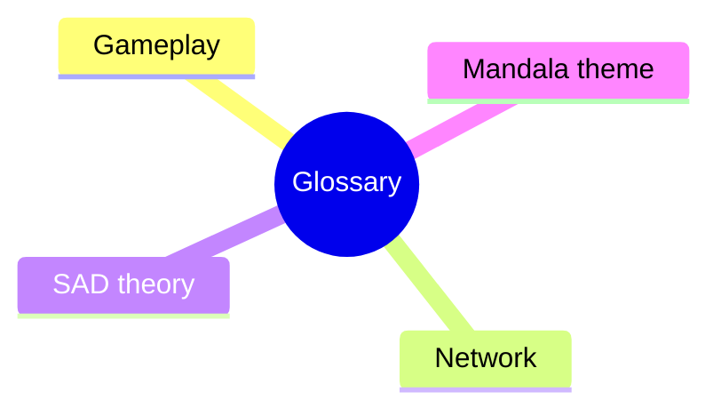

# Glossary — BomberMen-X

**Date:** 28 May 2026 · Week 7 of 8 — Prototype

Reference of terms used in BomberMen-X documentation, source code and lecture material. Terms are grouped into four sections, alphabetised within each. Concrete realisations are cited as class path or `FR-XX`.

---

## 1. Bomberman gameplay terminology

**Arena.** The 13×11 tile grid on which a match is played; holds solid walls, destructible walls, bombs, explosions, pickups and spawn corners. See `src/bomberman-core/src/main/java/com/bombermenx/core/world/Arena.java` and FR-34..FR-46.

**Blast cross.** Cross-shaped pattern of an explosion, extending up to `range` tiles in each cardinal direction until a solid wall stops it. `Explosion.java`, FR-50..FR-53.

**Bomb.** Timed device placed by a Bomberman; detonates after a fuse into a blast cross. `core/entity/Bomb.java`; FR-48, cap FR-49.

**Bomberman.** Player avatar with position, lives, `range`, bomb capacity and active power-ups. `core/entity/Bomberman.java`.

**Chain reaction.** A blast cross overlapping another live bomb collapses its fuse to zero, detonating it in the same tick. FR-54.

**Destructible wall.** Breakable tile blocking movement and explosions; removed by the first explosion reaching it, may reveal a pickup. `TileType.DESTRUCTIBLE`, FR-44..FR-47.

**Explosion.** Transient effect of a detonating bomb; occupies tiles briefly and damages any Bomberman on them. `Explosion.java`, FR-50..FR-55.

**Fuse.** Ticks from bomb placement to detonation (default 3 s). `GameConfig.java`; FR-48.

**Kill feed.** On-screen log of recent eliminations, sent as `KillFeedEntry` DTOs. FR-71.

**Lobby.** Pre-match screen where authenticated players gather, equip cosmetics and ready up. `LobbyHello`/`LobbyWelcome`/`LobbySnapshot`; FR-10..FR-20.

**Match.** One instance of play from countdown to win condition; bounded by `MatchStart` and `MatchEnd`. FR-30..FR-33.

**Move.** One-tile step requested by input, resolved server-side against arena collisions. `Direction.java`, `PlayerInput.java`, FR-40..FR-43.

**Pickup / Bonus.** Item dropped (often when a destructible wall breaks) granting a power-up on contact. `core/world/Bonus.java` and subclasses (`FlameBonus`, `ExtraBombBonus`, `SpeedBonus`, `KickBonus`, `ThrowBonus`, `LifeBonus`, `ArmorBonus`).

**Player.** Persistent account behind an avatar: id, display name, cosmetics, stats. `Player.java`; distinct from the in-match `Bomberman`.

**Power-up.** Effect a pickup grants — bomb capacity, range, speed, kick, throw, extra life, temporary armour. `PowerUpType.java`; FR-56..FR-62.

**Range / blast radius.** Tiles a blast extends in each cardinal direction; raised by `FlameBonus`. FR-56.

**Score.** Points accumulated for kills, survival time and objectives. `core/entity/Score.java`.

**Solid wall.** Indestructible tile that blocks movement and absorbs explosions; the fixed grid skeleton. `TileType.SOLID`, FR-34.

**Spawn corner.** One of four corners where players start, with a guaranteed-clear two-tile L-shape. FR-31.

**Sudden death.** End-game phase in which solid walls close in from the edges to force engagement. FR-72.

**Super-ability (NUKE / DASH).** Once-per-match special: `NUKE` detonates every live bomb owned at maximum range; `DASH` is a brief invulnerable sprint through bombs and walls. `AbilityRequest.java`; FR-63..FR-65.

**Team.** Grouping of players sharing a colour and win condition; in 1v1v1v1 a team equals a player. `GameMode.java`.

**Throw / kick.** Power-up actions that displace a placed bomb — `KickBonus` shoves it forward, `ThrowBonus` arcs it two tiles. FR-60, FR-61.

**Tile.** Atomic 32×32-pixel unit of the arena grid; holds at most one wall plus bombs, explosions and pickups. `core/world/Tile.java`.

**Tile coordinate (x, y).** Integer column-row index, origin top-left, x right, y down. `TilePos.java`.

**Token.** Opaque session credential issued after authentication; presented on the WebSocket handshake to bind connection to player. `AuthResult.java`, FR-3.

---

## 2. Network and protocol terminology

**Connector.** Runtime link between two components; here a single WebSocket per client carrying framed JSON envelopes.

**DTO (Data Transfer Object).** Small immutable record of data fields, used to move state across the network. `com.bombermenx.core.net.dto`.

**Envelope.** Outer wrapper around every wire message: `{ type, seq, ts, payload }`. `core/net/Envelope.java`.

**Frame.** One WebSocket text frame; here exactly one envelope. Input frames are `InputFrame` DTOs at the input tick rate.

**JSON.** JavaScript Object Notation; encoding for every envelope, via `WireCodec.java`.

**Latency.** One-way network delay in milliseconds; budgeted ≤ 80 ms on a LAN.

**Message type.** Enumerated tag for an envelope's payload kind (`HELLO`, `INPUT`, `SNAPSHOT`, `MATCH_END`, …). `MessageType.java`.

**Netty event loop.** Single-threaded I/O loop in Netty that drives the server's WebSocket reads and writes; one loop per thread.

**Ping / Pong.** Pair of empty envelopes that keep the connection alive and measure RTT; sent every two seconds.

**RTT (Round-Trip Time).** Time for a ping and pong to round-trip; upper bound on input-to-response latency.

**Sequence number.** Increasing integer in each envelope's `seq` field, used to detect drops and reorder inputs. FR-80.

**Session.** Logical connection between a player and the server, bounded by `HELLO` and disconnect; identified by a token.

**Snapshot.** Server-authoritative picture of the arena at one tick — players, bombs, explosions, pickups — serialised as `WorldSnapshot`. `Snapshotter.java`.

**Snapshot interpolation.** Client-side buffering of two snapshots and interpolating between them to hide jitter. NOT implemented here — the client renders the latest snapshot directly; known limitation in the runtime view.

**Server-authoritative state.** The server's simulation is the single source of truth; clients send inputs, not state. FR-81.

**Tick / tick rate.** One discrete simulation step; the server runs at 30 Hz (≈33 ms per tick), `GameConfig.TICK_HZ`.

**WebSocket.** Full-duplex TCP transport (RFC 6455) carrying every gameplay envelope after the HTTP upgrade handshake.

**Wire protocol.** Full agreement on framing, envelope schema, message types and ordering; in `server-client-communication.md`.

---

## 3. Software architecture and development (SAD) terminology

**ADR (Architectural Decision Record).** Short dated document capturing one decision — context, options, consequences.

**Allocation viewpoint.** View category mapping software to non-software (hardware, teams, artefacts); deployment is its main instance.

**Architectural decision.** Hard-to-reverse choice shaping quality attributes — e.g. "use WebSockets over UDP".

**Architectural style.** Named recurring pattern of components and connectors with constraints, e.g. Client-Server, Layered.

**arc42.** Free twelve-section architecture-documentation template; structures the BomberMen-X specification.

**Client-Server style.** Clients request services from a central server that owns shared state; the BomberMen-X topology.

**Component.** Unit of computation with explicit ports; first-class element of C&C views alongside connectors.

**Component-and-Connector (C&C) view.** Runtime view of components and the connectors between them.

**Composition (UML).** Strong whole-part relationship; the part cannot exist without the whole. Filled diamond.

**Configuration.** Concrete graph of components and connectors at runtime — an instance of a style.

**Connector.** Runtime element mediating interaction between components; here a WebSocket channel.

**Context view.** Diagram of the system as black box, naming every external actor and neighbouring system.

**Cross-cutting concept.** Design rule applied across components — logging, error handling, JSON wire format.

**Deployment view.** Allocation view mapping artefacts onto nodes; here laptop + JVM + browser.

**Event-driven style.** Components communicate by emitting and reacting to events on a shared bus.

**Layered style.** Components grouped into layers that may only call the layer beneath.

**Module-and-Data view.** Implementation units and their static dependencies; codebase, not runtime.

**MVC (Model-View-Controller).** Presentation pattern separating data, rendering and input handling; used in the JavaFX client.

**Peer-to-peer.** Every node is client and server of equal capability; rejected for Client-Server.

**Pipe-Filter style.** Data flows through a chain of stateless transformers; used in the server's input → simulation → snapshot pipeline.

**Port.** Typed interaction point on a component, bound to a connector at configuration time.

**Quality attribute / quality scenario.** Non-functional property (performance, security, modifiability) made concrete by "stimulus → environment → response → measure".

**Runtime view.** How the system behaves over time — sequence diagrams, state machines, message flows.

**Stakeholder.** Party with legitimate interest in the system: players, professor, graders, future maintainers.

**System scope.** Boundary separating what is built from what it depends on; in the context view.

**Traceability.** Recorded link between a requirement, the design element satisfying it and the test verifying it; see `requirements-traceability.md`.

**View.** Representation of the system from one viewpoint, for a stakeholder concern.

**Viewpoint.** Reusable specification of a view's contents and construction — the recipe; the view is the dish.

---

## 4. Indian / Mandala theme terminology

**Agni.** Vedic deity of fire and the sacred fire itself; the central bomb-blast frame is tinted Agni-orange to frame fire as transformative.

**Bindu.** Point at the centre of a mandala from which the pattern radiates; here the centre tile of the 13×11 grid, around which rotational symmetry is composed.

**Henna / Mehndi.** Reddish-brown dye from the henna plant, applied in fine line-work patterns at South Asian celebrations; its vine motifs inform the lobby cosmetic skins.

**Mandala.** Sanskrit for "circle"; a geometric, often radially symmetric composition used in Hindu and Buddhist art as meditative aid and cosmic map. Each arena map is treated as a mandala, with destructible walls preserving a chosen rotational symmetry.

**Mandala-fold (rotational symmetry, e.g. 8-fold).** A mandala's order of rotational symmetry — an *n*-fold mandala looks identical after rotation of 360°/*n*. Arena layouts favour 2-fold and 4-fold so each spawn corner faces an equivalent map.

**Saffron.** Deep orange-yellow spice and dye from *Crocus sativus*, in Indian culture a colour of courage and sacrifice; the UI highlight for ready-state and victory banners.

**Sindoor.** Vermilion red powder worn by married Hindu women along the hair parting; used sparingly as the kill-feed accent so eliminations carry cultural weight, not gore.

**Turmeric / Haldi.** Bright yellow rhizome powder central to South Asian cooking and the pre-wedding *haldi* blessing; in the pickup-glow shader for `LifeBonus`.

**Vāyu.** Vedic deity of wind; referenced in the `DASH` super-ability, whose pale-blue swirling trail evokes a gust rather than a sci-fi blur.
