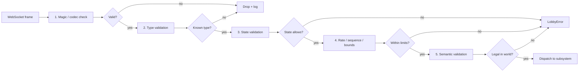
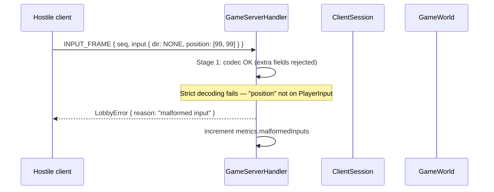
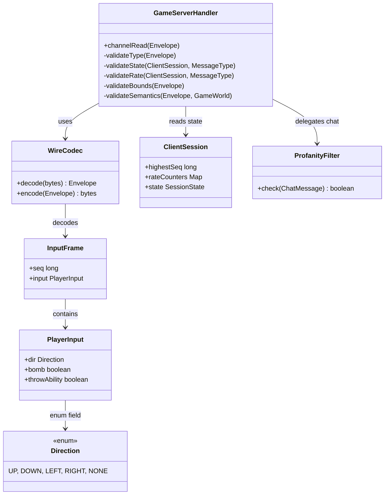

# Input Validation

**Project:** BomberMen-X
**Owner:** Jithendra Chittomothu (JC), with codec authorship by Abhilash Anuku (AA)
**Date:** 28 May 2026

This document specifies the input validation pipeline that protects the server from malformed, malicious, or accidentally-invalid traffic. The pipeline realises requirements FR-82 through FR-86 and is the structural anti-cheat mechanism for the system. The document also discusses why server-side authority is the only valid approach for a real-time multiplayer game of this shape, and lists the validation classes by responsibility.

## 1. Why server-side validation is the only valid approach

In a peer-to-peer or client-trusting design, every client receives the same right to mutate state. If even one client is hostile or buggy, every other client's experience is corrupted, and there is no algorithm that can distinguish the hostile mutation from a legitimate one without an external authority. Even in a "mostly trusted" client population, a single modified client can ruin every match it participates in by claiming kills it did not make, by teleporting, or by giving itself infinite power-ups.

A server-authoritative design moves the boundary of trust to the wire. Clients become advisors: they describe intent. The server is the sole party that converts intent into state. As a consequence, the only attack surface from a hostile client is the wire envelope itself, and the surface is small enough to validate exhaustively. The validation pipeline below is the realisation of that small surface.

The trade-off is latency: a server-authoritative design adds one round-trip to every action. This is acceptable for BomberMen-X because we render through interpolation and the round-trip on the lab network is well below one tick.

## 2. The five validation stages

Every inbound envelope passes through five stages, in this fixed order. The order is significant: cheaper checks run first to limit the cost of malicious traffic; semantic checks run last because they require world access.



### Stage 1 — Codec and magic number (FR-86)

`WireCodec` performs the first check. The decoder is configured to fail on unknown JSON fields and to reject any document that does not begin with the expected object structure. The "magic number" is the presence of both `type` and `payload` keys at the document root; envelopes missing either are rejected as malformed and the channel is closed. This stage exists to defeat malformed input that the JSON library would otherwise tolerate, and to make any future migration to a binary protocol easy: the magic check moves from "are these keys present" to "do these bytes match the framing header" without changing any downstream stage.

### Stage 2 — Type validation (FR-82, partially)

`GameServerHandler` reads the `type` field, looks it up in `MessageType`, and rejects any envelope whose type is unknown. Unknown types are silently dropped at this stage — not because the sender is necessarily malicious but because logging every unknown type would amplify any flooding attack. The metrics counter for "unknown type" is incremented, however, and a sustained increase would trigger investigation.

### Stage 3 — State validation (FR-84)

The session's state is consulted. An `INPUT_FRAME` from a session that is in `InLobby` state is rejected: the player is not in a match and cannot have inputs. A `LOBBY_BUY` from a session in `InMatch` is rejected: cosmetic purchases occur in the lobby phase only. The full table of (state, envelope kind) → legal pairs is encoded in `GameServerHandler` as a switch and is the most visually-checkable part of the validation pipeline.

### Stage 4 — Rate, sequence, and bounds validation (FR-83, FR-85)

Three sub-checks run together at this stage.

The **rate check** counts inbound envelopes per session per kind in a rolling one-second window. `INPUT_FRAME` is limited to 120/second; `CHAT_MESSAGE` to 2/second; `LOBBY_BUY` to 4/second; other envelopes to 30/second. Excess traffic is dropped silently to avoid amplification.

The **sequence check** applies to envelopes carrying a sequence number (currently `INPUT_FRAME` and `ABILITY_REQUEST`). The session's `ClientSession` records the highest sequence seen; envelopes with a sequence not strictly greater than the highest are dropped.

The **bounds check** verifies that payload fields fall within their declared ranges. `PlayerInput.dir` must be one of `UP`, `DOWN`, `LEFT`, `RIGHT`, or `NONE` (FR-82). `ChatMessage.text` must be at most 256 characters (BR-04). `LobbyMove.position` must be within the lobby room dimensions. Field bounds are encoded as constants on the DTO classes; a violation produces a `LobbyError` with a specific reason.

### Stage 5 — Semantic validation

The final stage consults the world. Three examples:

- A bomb placement requires the player's `bombBudget` to be greater than zero and the target `Tile.blockType` to be empty. Both are read directly from the `GameWorld` instance.
- A throw ability requires the player to hold a `ThrowBonus` and to have a bomb at their current tile. Both are read from the `Bomberman` and the world's bomb set.
- A cosmetic purchase requires the player's soft-currency balance to cover the cost and the cosmetic to exist in `CosmeticsCatalog`.

If semantic validation fails, the envelope is dropped and the sender receives a `LobbyError` describing the reason. The world is not mutated.

## 3. Rejection scenario — a malicious teleport attempt

A hostile client crafts an `INPUT_FRAME` whose payload contains a forged `position` field, hoping the server will move the player to that tile.



The server never reaches the simulation stage. The hostile field is rejected by the codec because the strict decoder does not tolerate unknown fields on the `PlayerInput` DTO. If the codec were lax, the field would be silently discarded at stage 1 — but the result is the same: only the declared fields of `PlayerInput` can ever reach the simulation, and `position` is not among them. The position of a `Bomberman` is determined exclusively by the simulation's movement computation.

A second example: a hostile client sends 10 000 `INPUT_FRAME` envelopes per second, hoping to overwhelm the simulation.

```mermaid
sequenceDiagram
    participant H as Hostile client
    participant G as GameServerHandler
    participant R as Rate budget
    loop 10000 envelopes
        H->>G: INPUT_FRAME { seq=n, input }
        G->>R: consume(playerId, INPUT_FRAME)
        alt budget remains
            R-->>G: ok
            G->>G: dispatch
        else budget exhausted
            R-->>G: drop
        end
    end
    Note over G: Effective rate capped at 120/s; 9880 dropped silently
```

The server's CPU exposure is bounded by the rate budget, regardless of how much traffic the client sends. The metrics counter for "rate-dropped inputs" records the over-sending, and a sustained pattern would inform a future ban-list feature.

## 4. Validation class diagram



The diagram is deliberately small: validation is concentrated in `GameServerHandler` with one helper per stage. Concentrating the pipeline in one class is itself a design choice — it means that adding a new message type requires editing one file, and reviewing the security posture is a single read of that file.

## 5. Per-requirement mapping

| Req     | Description                              | Stage | Class                                  |
|---------|------------------------------------------|-------|----------------------------------------|
| FR-82   | Direction bounds check                   | 4     | `GameServerHandler.validateBounds`     |
| FR-83   | Sequence number on input frames          | 4     | `InputFrame.seq` field, `ClientSession` |
| FR-84   | Out-of-order/duplicate dropped           | 4     | `GameServerHandler.validateRate`       |
| FR-85   | Rate cap 120/s per session                | 4     | `GameServerHandler` rate counters       |
| FR-86   | Magic-number / strict JSON decoding       | 1     | `WireCodec` (Jackson strict config)    |

## 6. Chat-specific validation

Chat traffic flows through `ChatRouter`, which adds a sixth stage specific to chat: the message text is passed through `ProfanityFilter` and rejected if it contains any blocked term. The filter is a fixed deny-list with case-folded and whitespace-stripped comparison. It is not a sophisticated moderation engine; it is sufficient for a prototype demonstration and is named in the SAD theory mapping as a "detect attacks" tactic.

## 7. Metrics

`MetricsHandler` exposes counters for each rejection reason: `inputs.dropped.malformed`, `inputs.dropped.rate`, `inputs.dropped.sequence`, `inputs.dropped.bounds`, `inputs.dropped.semantics`, `chat.dropped.profanity`. The counters are per-session in aggregate (not per-player, to avoid PII exposure on the metrics endpoint). During the defence we keep `/metrics` open in a browser tab and the counters tick at zero for a clean run; any spike during the demo would prompt investigation.

## 8. What is deliberately not validated client-side

The client does basic UX-level bounds: it does not send an empty chat message, it does not send a bomb-place envelope if the local HUD shows zero bombs available. These are convenience checks, not security checks. The server validates the same fields again because the server cannot trust the client. The duplicate validation is intentional and is documented in the arc42 spec under the "validate inputs" tactic.

## 9. Future work

Three named improvements are out of scope for the prototype but recorded as technical debt.

First, the rate counters are in-memory and reset on server restart; a future iteration would persist them so that a banned actor cannot reset by triggering a server restart through other means.

Second, the bounds tables for each DTO are embedded in `GameServerHandler`; a future iteration would attach annotations to the DTO fields and let an annotation processor generate the bounds checks, removing the risk of drift between the DTO declaration and the validator.

Third, the semantic checks are inlined in the handler; a future iteration would extract them into a `SemanticValidator` interface with one implementation per envelope kind, improving testability.

## 10. Closing note

Input validation is the part of the system that distinguishes a real-time multiplayer game from a graphical toy. The pipeline above is the codified answer to "what can the client lie about?". The answer is: nothing that affects the world. The client can speak; the server decides what to hear.
