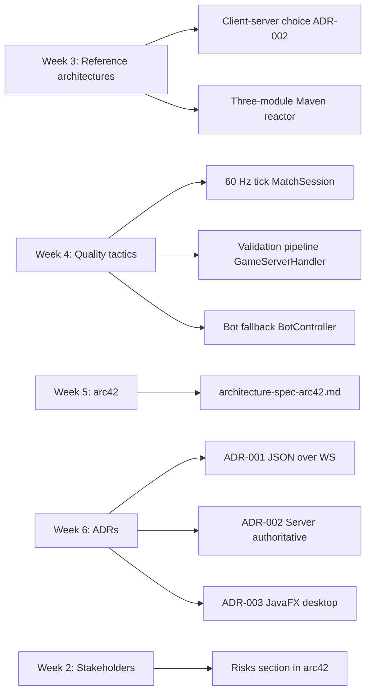
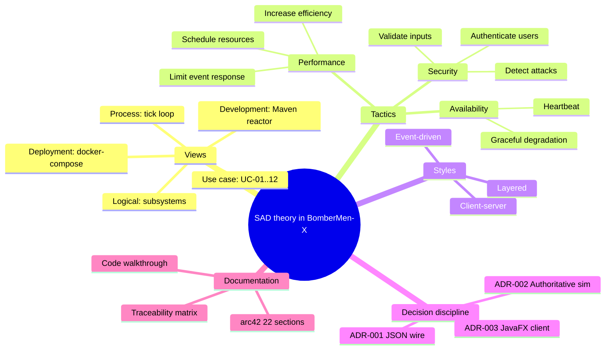
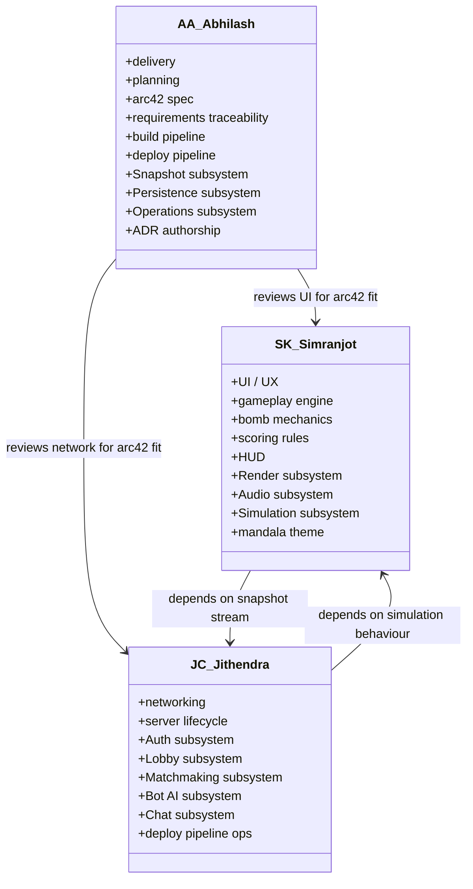

# SAD Theory and Architect Roles

**Module:** Software Architecture & Design, M.Sc. Applied Computer Science
**Supervisor:** Dr. Floriment Klinaku, SRH University Stuttgart
**Architects:** Abhilash Anuku (AA), Simranjot Kaur (SK), Jithendra Chittomothu (JC)
**Date:** 28 May 2026

This document maps the theoretical content of the SAD module — views, tactics, styles, and decision discipline — onto concrete artefacts in the BomberMen-X codebase. The intent is to show that the prototype is not merely "an application that happens to compile" but a realisation of the lecture material from weeks three and four. The document also formalises the ownership matrix among the three architects, so that the panel can ask "who decided this, and on what authority?" and get a precise answer.

## 1. Views

The 4+1 view model attributed to Kruchten and reinforced in the module's week-five lecture distinguishes the logical view, the process view, the development view, the physical (deployment) view, and the use case (scenarios) view. BomberMen-X is documented in three of these views; the other two are absorbed into the arc42 spec.

**Logical view.** Captured in §5 of the arc42 spec ("Building Block View") and in `systems-architecture.md`. The logical decomposition is the twelve-subsystem layout, each subsystem with a primary class set and a stated responsibility. The logical view is what you would draw on a whiteboard to explain the system to a new developer.

**Process view.** Captured in §6 of the arc42 spec ("Runtime View") and in `server-client-communication.md`. The dominant runtime structure is two concurrent loops: the server's 60 Hz tick loop in `MatchSession`, and the client's JavaFX render loop. They communicate exclusively through `Envelope` instances.

**Deployment view.** Captured in §7 of the arc42 spec and in `RUN_GUIDE.md`. The deployment is a single Docker Compose stack with one game-server container exposing two ports; the client is a desktop JAR on the host.

**Use case view.** Captured in `requirements-traceability.md`, which lists UC-01 through UC-12 with their entry classes.

**Development view.** The Maven reactor structure is the development view: three modules with a strict dependency direction. This is documented in `code-walkthrough.md` and is enforced by the build.

## 2. Tactics

The Bass/Clements/Kazman tactic catalogue presented in week four organises tactics by quality attribute. BomberMen-X uses tactics from three categories.

### 2.1 Performance tactics

**Resource management — schedule resources.** The server schedules each `MatchSession` on a dedicated executor at a fixed 60 Hz. The tick rate is a hard contract; if a tick overruns, the next tick runs immediately rather than skipping. This bounds tail latency.

**Control resource demand — limit event response.** The wire dispatcher rate-limits `INPUT_FRAME` envelopes to 120 per second per session. Excess inputs are dropped before they reach the simulation, capping the cost the simulation can ever incur from a single client.

**Reduce computational overhead — increase efficiency of resources.** Snapshots are projections, not deep copies, of the world. `Snapshotter` walks the world once per tick and writes flat DTOs; there is no intermediate object graph.

### 2.2 Availability tactics

**Fault detection — heartbeat.** Each client session is monitored by Netty's idle-state handler. A session with no inbound traffic for 30 seconds is considered disconnected.

**Recovery — graceful degradation.** When a player disconnects mid-match, the slot is handed to `BotController`. The match continues at degraded but acceptable quality. If the player reconnects within 30 seconds, control returns; otherwise the bot finishes the match.

### 2.3 Security tactics

**Resist attacks — validate inputs.** Every inbound envelope passes through the five-stage validation pipeline documented in `input-validation.md`. The client cannot author state directly; it can only request, and every request is validated.

**Resist attacks — authenticate users.** Every channel must complete an authentication exchange before any lobby state is exposed. The active provider is configurable via `AuthRegistry`.

**Detect attacks — moderation pipeline.** `ProfanityFilter` is a degenerate but visible case of attack detection: malicious chat is rejected before it reaches other players.

## 3. Architectural styles

The system combines three styles cleanly.

**Client-server.** The macroscopic shape: one authoritative server, many subordinate clients. The trust boundary is the wire.

**Event-driven.** The internal shape of the server: `GameServerHandler` dispatches envelopes by type, `MatchSession` consumes inputs from a queue, `Snapshotter` emits outputs each tick. Events flow forward; there is no synchronous call from one subsystem to another for gameplay state.

**Layered.** The internal shape of each module: a domain layer at the bottom, a simulation/wire layer in the middle, a transport/rendering layer at the top. The layering is enforced by package boundaries and reviewed at PR time.

The combination is not unique to this project; it is the canonical style for real-time multiplayer games. The reason it works is that each style addresses a different concern: client-server addresses trust, event-driven addresses concurrency, layered addresses cognitive complexity.

## 4. Concept-to-code map

The diagram below shows how each module-week concept maps to a concrete code artefact.

The diagram is incomplete by design; it shows only the concepts that the panel is most likely to probe. The full map would include the use-case view, the views-and-beyond extensions, and the deployment artefact, all of which are documented elsewhere.

## 5. SAD theory mindmap

## 6. Architect roles and ownership

The three architects share full read/write access to the codebase. Ownership is about who decides, not who can touch.

### Decision rights

A decision affecting only one architect's domain may be made unilaterally and recorded in that architect's daily log. A decision crossing two domains requires a written agreement between the two architects, recorded as a PR description. A decision crossing all three domains or carrying architectural significance is recorded as an ADR.

Three ADRs have been written: ADR-001 (JSON over WebSocket, authored by AA with input from JC), ADR-002 (server-authoritative simulation, authored by AA with input from SK and JC), and ADR-003 (JavaFX desktop client, authored by SK with input from AA). All three are reproduced in the arc42 spec.

### Code review discipline

Every pull request requires one reviewer who is not the author. For changes inside a single subsystem, the reviewer is the subsystem owner. For cross-subsystem changes, the reviewer is the architect whose subsystem is being entered. This rule has been in force since week four.

### Daily standup

The team runs a fifteen-minute standup at 09:30 every working day. Each architect reports three items: what was completed since the last standup, what is in progress, and what is blocked. Blocked items are escalated to AA for resolution because delivery is the AA role.

## 7. Mapping to specific lecture material

The week-three lecture introduced six reference architectures: pipe-and-filter, layered, client-server, peer-to-peer, event-driven, microkernel. We chose client-server because the dominant quality driver is integrity (a hostile client must not be able to fabricate state) and the secondary driver is responsiveness (the server must answer the client within one tick). Pipe-and-filter and microkernel were rejected because they do not naturally fit a real-time loop. Peer-to-peer was rejected because the integrity story for P2P games is significantly more complex and would have consumed the entire prototype window. Layered remains as an internal style within each module, demonstrating that the styles compose.

The week-four lecture introduced quality attributes through scenarios. We constructed three explicit scenarios that drove the tactic selection: "a client sends 10 000 input frames per second" (driven by the rate-limit tactic), "a player's connection drops mid-match" (driven by the bot-fallback tactic), and "an examiner inspects the system at runtime" (driven by the metrics endpoint). Each scenario has a measurable response time (one tick, 30 seconds, 200 ms HTTP response respectively) and each is realised by a named class.

The week-five lecture introduced arc42 as a documentation template. The arc42 spec in this directory is the direct application; its section ordering and inclusion criteria follow the template strictly.

The week-six lecture introduced the ADR format. Our three ADRs follow the template strictly: status, context, decision, consequences. They are not afterthoughts — the decisions were taken in the week the ADR records, and the ADR was written within forty-eight hours of the decision.

## 8. Risks named by the theory

The week-four lecture's discussion of architectural risk identifies five risk classes: integrity, availability, performance, modifiability, and operational. Our prototype carries explicit risk in three of these.

**Performance.** The 60 Hz tick budget is tight. We have not stress-tested at eight players with a heavy bomb count. Mitigation: the simulation profile is in place and the bot-fallback tactic gives us a path to demonstrate degraded-but-acceptable behaviour.

**Modifiability.** The wire format is JSON with strict field decoding. Adding a field requires a capability flag exchange that is documented but not yet implemented. Mitigation: the contract is versioned at 1.0 and any breaking change would bump it.

**Operational.** Persistence is file-backed. A crash mid-write would corrupt the rankings file. Mitigation: writes are atomic (write to temp file, rename) and the rankings file is not on the critical path for any demo scenario.

## 9. Closing remark

The mapping in this document is the answer to the question "why is this architecture defensible?" The defence is not "because it works" — many designs work. The defence is "because each architectural choice corresponds to a named lecture concept, each concept corresponds to a quality driver, each quality driver corresponds to a measurable scenario, and each scenario corresponds to a Java class." That four-step chain is what makes the prototype an SAD deliverable rather than a software project.
