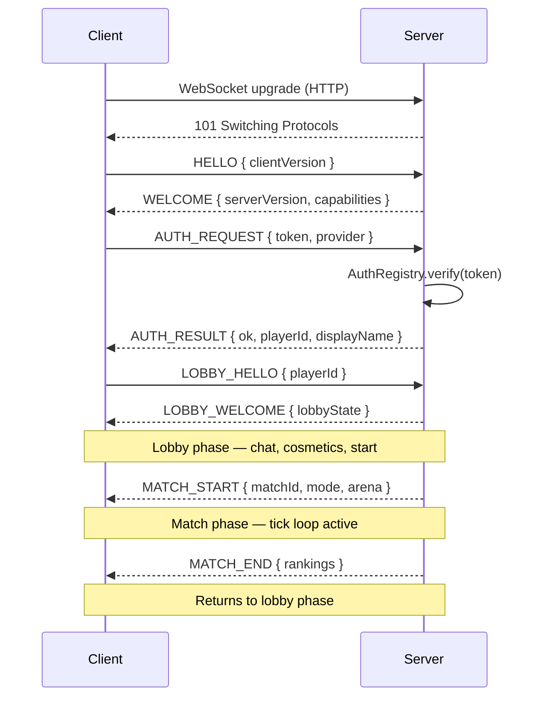
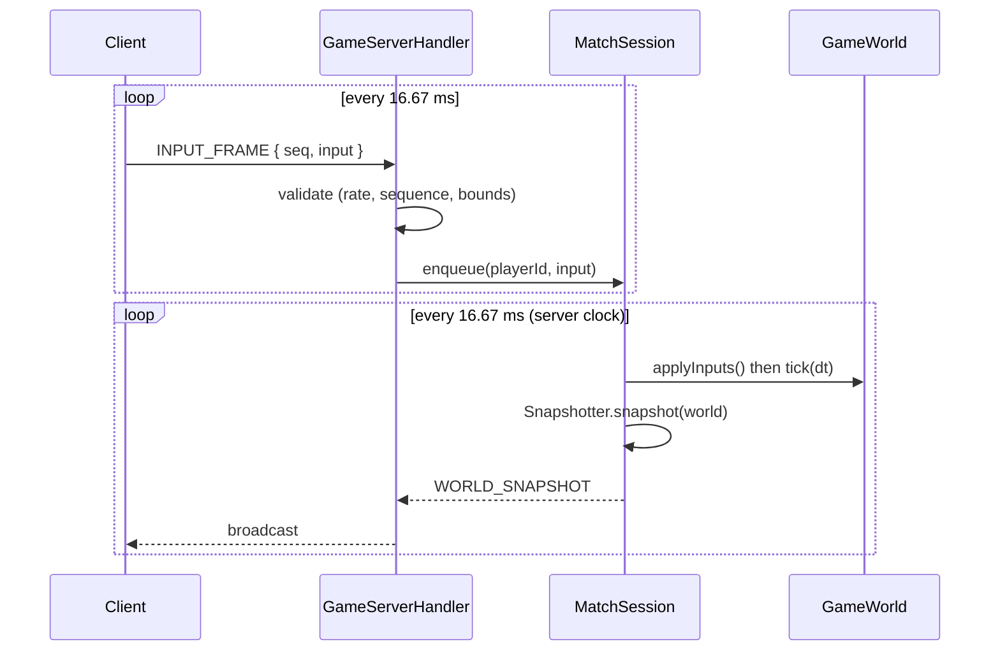
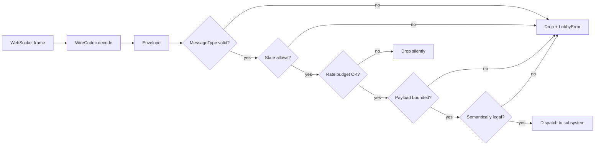
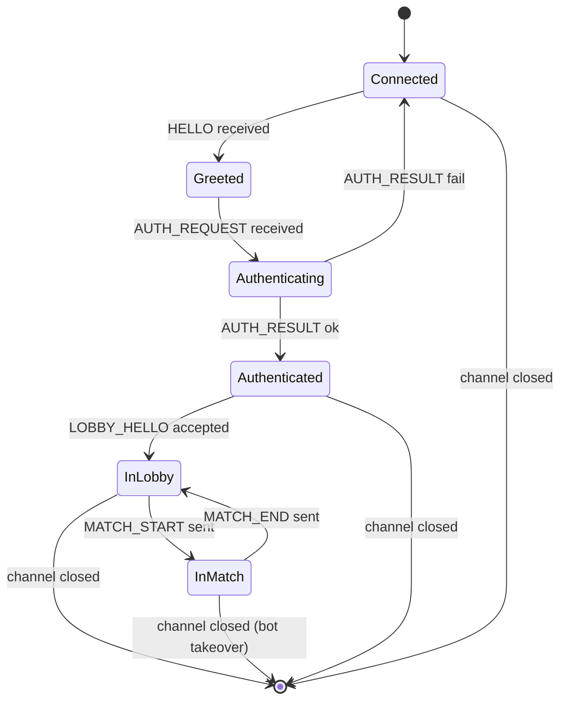

# Server-Client Communication

**Project:** BomberMen-X
**Owner:** Jithendra Chittomothu (JC), with wire-protocol authorship by Abhilash Anuku (AA)
**Date:** 29 May 2026

This document specifies the wire protocol between the BomberMen-X client and server. It covers the transport, the envelope format, the message types, the connection lifecycle, the tick loop, and the rules for handling out-of-order or invalid traffic. The protocol is small enough to be read in one sitting and is the single point at which the two modules `bomberman-client` and `bomberman-server` meet.

## 1. Transport

The only transport is WebSocket over TCP, opened by the client to the server on port 8080. The Netty pipeline on the server is set up in `WebSocketServer`. There is no fallback transport; the prototype does not implement HTTP long-poll or any other downgrade path because the deployment targets and the lab network both support WebSocket natively.

A single connection carries the entire conversation: authentication, lobby, and match traffic share one channel. There is no separate signalling channel and no out-of-band communication.

## 2. Envelope

Every message on the wire is a JSON document of the form:

```
{
  "type": "<MessageType>",
  "payload": { ... DTO fields ... }
}
```

The wrapper is the `Envelope` class. The discriminator is the `MessageType` enum. The payload is the JSON encoding of the DTO selected by the type. Encoding and decoding are performed by `WireCodec`, a thin wrapper around Jackson with a single `ObjectMapper` configured for strict failure on unknown properties — this is deliberate: silently dropping unknown fields would conceal protocol drift.

The set of message types covers four families.

**Handshake:** `HELLO`, `WELCOME`.

**Auth:** `AUTH_REQUEST`, `AUTH_RESULT`.

**Lobby:** `LOBBY_HELLO`, `LOBBY_WELCOME`, `LOBBY_STATE`, `LOBBY_MOVE`, `LOBBY_BUY`, `LOBBY_EQUIP`, `LOBBY_SNAPSHOT`, `LOBBY_ERROR`.

**Match:** `MATCH_START`, `MATCH_END`, `INPUT_FRAME`, `ABILITY_REQUEST`, `WORLD_SNAPSHOT`, `CHAT_MESSAGE`, `KILL_FEED`, `GAME_EVENT`, `HAPTIC_CUE`, `VOICE_FRAME` (reserved).

## 3. Connection lifecycle

The lifecycle is a strict state machine on each `ClientSession` instance, enforced server-side. Out-of-order envelopes for the current state are answered with a `LOBBY_ERROR` and ignored.



Each arrow corresponds to exactly one envelope. The `HELLO`/`WELCOME` exchange exists because the WebSocket upgrade alone does not negotiate application-level versions; we want a wire-level handshake that survives reverse proxies that strip custom HTTP headers.

## 4. Tick loop

The server runs a fixed 60 Hz tick inside each `MatchSession`. The client sends one `INPUT_FRAME` per tick (more is rate-limited away). The server sends one `WORLD_SNAPSHOT` per tick, broadcast to every session attached to the match.



Note that the client tick and the server tick are independent. The client sends at its own rate (60 Hz nominally) and the server applies what it has at its own tick boundary. This decoupling absorbs jitter without needing handshake-style synchronisation.

## 5. Input reconciliation

Each `INPUT_FRAME` carries a sequence number monotonically increasing per session. The server tracks the highest sequence seen per session in `ClientSession`. Frames whose sequence is less than or equal to the highest seen are dropped silently (they are duplicates or stragglers). Frames whose sequence skips forward are accepted; the gap is interpreted as packet loss and is not reconstructed.

The server does not echo the sequence number back to the client because the client does not need it for the prototype. A future iteration could echo it inside `WORLD_SNAPSHOT` to enable client-side prediction with rollback.

## 6. Validation pipeline

Every inbound envelope passes through `GameServerHandler`, which performs the checks in this order:

1. **Type validation.** The `MessageType` enum value is recognised; otherwise the envelope is dropped and a `LOBBY_ERROR` is sent.
2. **State validation.** The session's current lifecycle state permits the envelope kind; otherwise the envelope is dropped and a `LOBBY_ERROR` is sent.
3. **Rate validation.** The session has not exceeded its rate budget for the kind; otherwise the envelope is dropped silently to avoid amplification.
4. **Payload validation.** The DTO's fields are within bounds; otherwise the envelope is dropped and a `LOBBY_ERROR` is sent.
5. **Semantic validation.** The action is legal given the world (for example, the player has bomb budget remaining); otherwise the envelope is dropped and a `LOBBY_ERROR` is sent.



The five checks reflect five distinct trust boundaries; running them in this fixed order is what gives the validation pipeline its determinism.

## 7. Session state machine

Each `ClientSession` is in one of these states. Transitions are driven by inbound envelopes and by server events.



The transitions are exhaustive. Any envelope received in a state where it is not legal triggers a `LOBBY_ERROR`. Channel closure can occur in any state and is handled by `SessionRegistry.onClose()`, which detaches lobby/match attachments and, in the `InMatch` case, hands the slot to `BotController`.

## 8. Broadcast semantics

The server broadcasts certain envelopes to all sessions in a match: `WORLD_SNAPSHOT`, `MATCH_START`, `MATCH_END`, `KILL_FEED`, `GAME_EVENT`. Chat is broadcast to all sessions in the same channel (lobby-wide or match-wide). `HAPTIC_CUE` is unicast to a specific player. `LOBBY_STATE` is broadcast to the entire lobby. `WELCOME`, `AUTH_RESULT`, `LOBBY_WELCOME`, and `LOBBY_ERROR` are always unicast to the requesting session.

The server uses one Netty `ChannelGroup` per broadcast scope. Group membership is updated by `SessionRegistry` on lifecycle transitions.

## 9. Backpressure

The server uses Netty's write watermark mechanism. When a session's outbound buffer crosses the high watermark, the server skips that session's snapshot broadcast for one tick and increments a "dropped snapshot" counter exposed via `MetricsHandler`. When the buffer drains below the low watermark, broadcast resumes. The client never experiences this directly — it sees a slightly stale snapshot and interpolates from the previous frame.

## 10. Error and disconnect semantics

The protocol distinguishes three kinds of failure. **Protocol-level failure** (malformed JSON, unknown type) closes the channel after sending `LOBBY_ERROR` with a generic reason; the client is expected to reconnect. **Application-level failure** (e.g., attempting to buy a cosmetic the player cannot afford) sends `LOBBY_ERROR` with a specific reason; the channel remains open. **Network-level failure** (channel closure by either side) triggers the lifecycle cleanup described in §7.

The client treats a closed channel as a recoverable event up to three retries with a one-second back-off; after three failures it returns to the main menu and asks the user to retry manually.

## 11. Wire frame examples

A sample `INPUT_FRAME` envelope sent by a client moving right and pressing bomb:

```json
{
  "type": "INPUT_FRAME",
  "payload": {
    "seq": 1842,
    "input": { "dir": "RIGHT", "bomb": true, "throwAbility": false }
  }
}
```

A sample `WORLD_SNAPSHOT` envelope for a two-player arena with one live bomb:

```json
{
  "type": "WORLD_SNAPSHOT",
  "payload": {
    "tick": 4321,
    "players": [
      { "id": "p-001", "pos": [4, 3], "lives": 3, "score": 200 },
      { "id": "p-002", "pos": [8, 7], "lives": 2, "score": 350 }
    ],
    "bombs": [{ "ownerId": "p-001", "pos": [4, 3], "fuse": 1.8, "radius": 2 }],
    "explosions": [],
    "pickups": [{ "pos": [6, 5], "bonus": "FLAME" }]
  }
}
```

## 12. Forward compatibility

The wire format is JSON, but the contract is the set of `MessageType` values and the DTO classes. A future version that needs to add a field can do so on the server first; older clients that have not learned the field will receive a `WORLD_SNAPSHOT` with an unknown field, which `WireCodec` will reject. To avoid breakage, the contract requires that any new field on a server-to-client envelope is introduced behind a capability flag negotiated in `WELCOME`. No such flag is currently active; the contract surface is documented as version `1.0`.

## 13. What this document deliberately omits

This document does not cover the binary representation of WebSocket frames (Netty handles that), the TLS layer (the prototype runs unencrypted on the lab network; production deployment would terminate TLS at a reverse proxy), or the metrics protocol (covered in `RUN_GUIDE.md`). The omitted concerns are real but are not part of the application-level contract.
