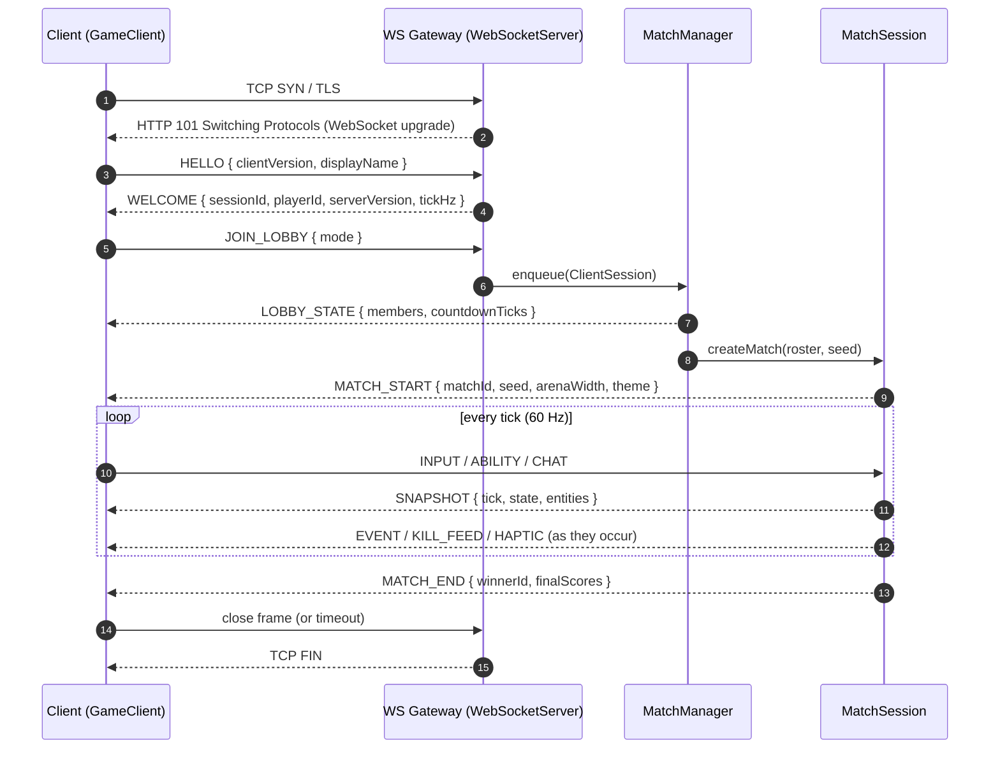
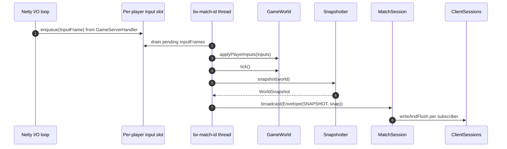
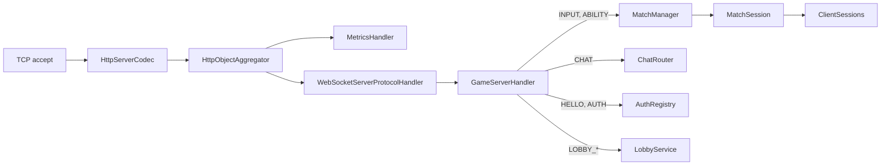
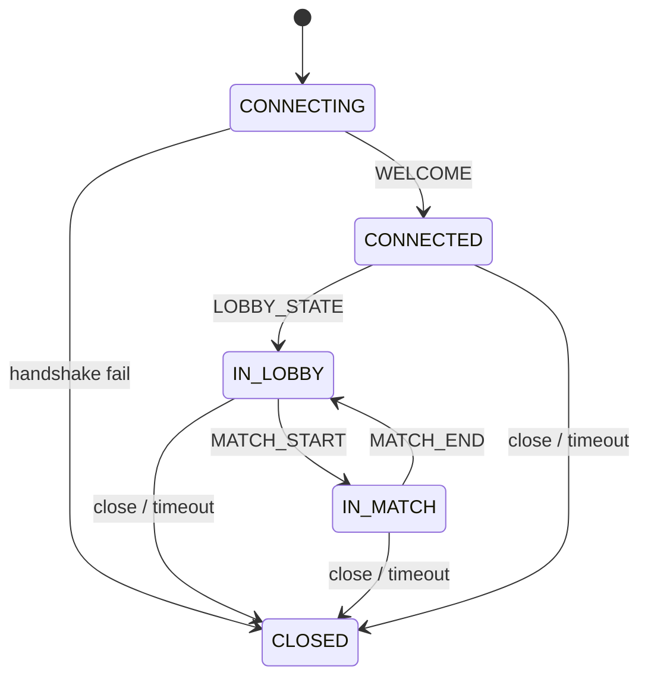

# BomberMen-X — Server / Client Communication

**Date:** 28 May 2026 · Week 7 of 8 — Prototype
**Module:** Software Architecture and Development (M.Sc. Applied Computer Science, SRH University Stuttgart)
**Reviewer:** Prof. Dr. Floriment Klinaku
**Networking owner:** JC · **Consumers:** AA (delivery, spec), SK (UI/UX, gameplay)

---

## 1. Communication model

BomberMen-X implements a server-authoritative real-time multiplayer protocol over one bidirectional WebSocket per Client. The Server holds the canonical simulation; Clients submit intent (`InputFrame`, `AbilityRequest`) and receive periodic authoritative state (`WorldSnapshot`). Clients never mutate game state locally — they render what the Server publishes.

Three components define the wire layer, colocated under `src/bomberman-core/src/main/java/com/bombermenx/core/net/`:

- `WireCodec` — final utility holding one configured Jackson `ObjectMapper` (`JavaTimeModule` registered, `WRITE_DATES_AS_TIMESTAMPS` disabled, `FAIL_ON_UNKNOWN_PROPERTIES` disabled). Both sides depend on it for identical serialization.
- `WebSocketServer` (`src/bomberman-server/.../net/WebSocketServer.java`) — Netty listener performing the HTTP-to-WebSocket upgrade and installing the inbound pipeline.
- `GameClient` (`src/bomberman-client/.../net/GameClient.java`) — Netty Client endpoint, `AutoCloseable`, with listener callbacks for JavaFX.

Transport is plain WebSocket text frames carrying UTF-8 JSON. Binary Kryo on the `SNAPSHOT` hot-path is reserved for post-prototype; JSON keeps demos legible.

## 2. The envelope

Every frame on the wire — in either direction — is a single JSON object conforming to the `Envelope` shape:

```java
public record Envelope(MessageType type, long seq, long ts, Object payload) { }
```

(The on-disk class is a mutable POJO with the same canonical fields for Jackson reflection convenience; semantically it behaves as a record.)

- `type` — discriminator (Section 3).
- `seq` — monotonic per-connection sequence; used for deduplication and lost-frame detection.
- `ts` — sender wall-clock millis; consumed by the latency-budget calculation.
- `payload` — `MessageType`-specific record, loosely typed at the envelope level and re-decoded via `WireCodec.decodePayload(env, Concrete.class)` on the receiver.

Example wire frame (Client to Server, requesting movement):

```json
{
  "type": "INPUT",
  "seq": 4217,
  "ts": 1748430712041,
  "payload": {
    "sequence": 4217,
    "clientTickMs": 1748430712041,
    "movement": "RIGHT",
    "placeBomb": false,
    "detonateRemote": false
  }
}
```

The envelope is annotated `@JsonInclude(NON_NULL)`, so absent fields are elided and snapshots stay compact.

## 3. MessageType catalogue

The full vocabulary lives in `src/bomberman-core/src/main/java/com/bombermenx/core/net/MessageType.java`. Direction is C-to-S (Client to Server), S-to-C (Server to one Client), or S-to-all (broadcast to every Client in scope).

| Type | Direction | Purpose | Key payload fields |
|---|---|---|---|
| `HELLO` | C-to-S | Handshake on connect | `clientVersion`, `displayName` |
| `AUTH` | C-to-S | Optional OIDC sign-in | `provider`, `idToken` |
| `JOIN_LOBBY` | C-to-S | Enter queue / named lobby | `lobbyId`, `mode` |
| `LEAVE_LOBBY` | C-to-S | Withdraw from lobby | — |
| `READY` | C-to-S | Toggle ready state | `ready` |
| `INPUT` | C-to-S | Per-tick movement / bomb intent | `InputFrame` |
| `ABILITY` | C-to-S | Trigger super-ability | `slot`, `ability` |
| `CHAT` | C-to-S | Text chat | `scope`, `text` |
| `VOICE_FRAME` | C-to-S | Opaque Opus voice frame | `scope`, `codec`, `payload` |
| `PING` | C-to-S | RTT measurement | `clientTs` |
| `WELCOME` | S-to-C | Handshake accepted | `sessionId`, `playerId`, `serverVersion`, `tickHz` |
| `AUTH_RESULT` | S-to-C | Verdict on `AUTH` | `success`, `playerId`, `reason` |
| `LOBBY_STATE` | S-to-all (lobby) | Roster, ready, countdown | `lobbyId`, `members[]`, `countdownTicks` |
| `MATCH_START` | S-to-all (match) | Begin authoritative ticking | `matchId`, `seed`, `arenaWidth`, `mode`, `theme` |
| `SNAPSHOT` | S-to-all (match) | Authoritative `WorldSnapshot` | `tick`, `state`, arena tiles, entity lists |
| `EVENT` | S-to-all (match) | One-shot in-game event | `GameEvent.Kind`, `data` |
| `KILL_FEED` | S-to-all (match) | Kill notification | `killerId`, `victimId`, `cause` |
| `HAPTIC` | S-to-C | Server-driven rumble cue | `pattern`, `magnitude`, `durationMs` |
| `MATCH_END` | S-to-all (match) | Final scoreboard | `winnerId`, `finalScores[]` |
| `PONG` | S-to-C | Reply to `PING` | `clientTs`, `serverTs` |
| `ERROR` | S-to-C | Protocol / session error | `code`, `message` |
| `LOBBY_HELLO` | C-to-S | Enter 3D plaza | `name`, `equipped` |
| `LOBBY_MOVE` | C-to-S | Avatar pose, 10 Hz | `x`, `z`, `yaw` |
| `LOBBY_BUY` | C-to-S | Purchase cosmetic | `itemId` |
| `LOBBY_EQUIP` | C-to-S | Equip owned cosmetic | `itemId` |
| `LOBBY_WELCOME` | S-to-C | Wallet and inventory | `coins`, `owned[]`, `equipped` |
| `LOBBY_SNAPSHOT` | S-to-all (plaza) | Persistent-lobby state | `players[]`, `yourCoins`, `yourOwned`, `yourEquipped` |
| `LOBBY_ERROR` | S-to-C | Purchase / equip error | `code`, `reason` |

String identifiers are stable — never reorder or rename without a protocol-version bump.

## 4. Connection lifecycle

Each Client maintains one long-lived WebSocket connection; the lifecycle below maps one-to-one to handlers in `GameServerHandler`.



`WELCOME` carries `tickHz` so the Client sizes its prediction buffer without hard-coding the rate.

## 5. The 60 Hz tick loop and snapshot broadcast

Each active `MatchSession` runs a single-threaded fixed-rate scheduler at `ServerConfig.tickHz()` Hz (60 in the prototype). The thread, named `bx-match-<id>`, is the **only** writer to that match's `GameWorld`.



Each `MatchSession.tick()` drains the per-player input slot (lock-free single-slot replacement), calls `world.tick()`, builds a `WorldSnapshot` via `Snapshotter.snapshot(world)`, wraps it in an `Envelope(SNAPSHOT, ...)` and broadcasts to every `ClientSession`, then drains any new `KillFeedEntry` events. Exceptions are caught and logged so one bad input cannot kill the match.

## 6. Major DTOs

All DTOs are immutable Java records under `src/bomberman-core/src/main/java/com/bombermenx/core/net/dto/`.

- **`InputFrame(long sequence, long clientTickMs, Direction movement, boolean placeBomb, boolean detonateRemote)`** — per-tick intent; `sequence` deduplicates on the Server.
- **`WorldSnapshot(long tick, GameState state, int arenaWidth, int arenaHeight, byte[] arenaTiles, List<PlayerSnapshot> players, List<BombSnapshot> bombs, List<ExplosionSnapshot> explosions, List<PickupSnapshot> pickups)`** — full authoritative state; `arenaTiles` is a row-major byte array of `TileType.ordinal()`.
- **`PlayerSnapshot(String id, String name, int x, int y, float subTileProgress, Direction facing, boolean alive, int bombs, int power, float speed, int score, int tokens, int abilityXCooldownTicks, int abilityYCooldownTicks, int controlPoints, int team)`** — per-player projection. `tokens` + cooldowns back the V0.2 super-ability economy; `team = -1` in FFA.
- **`BombSnapshot(long id, String ownerId, int x, int y, int power, int fuseTicks)`** — one active bomb.
- **`ExplosionSnapshot(long id, String ownerId, List<int[]> tiles, int lifetimeTicks)`** — blazing tiles for one detonation.
- **`PickupSnapshot(long id, int x, int y, PowerUpType type)`** — a power-up on the ground.
- **`MatchStart(String matchId, long seed, int arenaWidth, int arenaHeight, long startTickMs, String mode, int level, String theme)`** — fired once at match begin; `seed` enables deterministic replay.
- **`MatchEnd(String matchId, String winnerId, List<PlayerSnapshot> finalScores)`** — terminal scoreboard.
- **`ChatMessage(String scope, String playerId, String displayName, String text, long ts)`** — Server stamps trusted identity on relay, preventing impersonation.
- **`KillFeedEntry(long ts, String killerId, String killerName, String victimId, String victimName, String cause)`** — one feed row.
- **`HapticCue(String pattern, double magnitude, int durationMs)`** — `pattern` is a string ID so new cues need no protocol bump.
- **`AbilityRequest(String slot, String ability)`** — slot `"X"` / `"Y"`; ability `"NUKE"` / `"DASH"`.
- **`Hello(String clientVersion, String displayName)`** / **`Welcome(String sessionId, String playerId, String serverVersion, int tickHz)`** — handshake pair.
- **`AuthRequest(String provider, String idToken)`** / **`AuthResult(boolean success, String playerId, String displayName, String provider, String linkedProviderUserId, boolean isMinor, String reason)`** — optional sign-in; `isMinor` gates youth-protection paths.
- **`GameEvent(Kind kind, Map<String,Object> data)`** — schemaless `data` bag driven by `Kind` (`BOMB_PLACED`, `BOMB_EXPLODED`, `WALL_DESTROYED`, `POWERUP_DROPPED`, `POWERUP_COLLECTED`, `PLAYER_KILLED`, `PLAYER_RESPAWNED`, `SUDDEN_DEATH`).
- **`VoiceFrame(String scope, String playerId, long sequence, long ts, String codec, int sampleRateHz, byte[] payload)`** — opaque Opus relay; Server never decodes audio.
- **`LobbyState(String lobbyId, int countdownTicks, List<LobbyMember> members)`** with `LobbyMember(playerId, name, ready, isBot)`.

## 7. Server-side Netty pipeline

`WebSocketServer` constructs the channel pipeline; `GameServerHandler` dispatches inbound frames; `MetricsHandler` serves `/metrics` (Prometheus) and `/health` (Cloud Run readiness).



`GameServerHandler` extends `SimpleChannelInboundHandler<WebSocketFrame>` and receives four collaborators by constructor injection (`MatchManager`, `ChatRouter`, `AuthRegistry`, `LobbyService`). HTTP requests for `/metrics` and `/health` short-circuit through `MetricsHandler` before the WebSocket handshake; everything else is upgraded and dispatched by `type`.

## 8. Client side

`GameClient` is a final class implementing `AutoCloseable`. It owns its own `NioEventLoopGroup`, one Netty channel, and a small set of `Consumer` listeners that the JavaFX UI (owned by SK) registers at startup:

```java
client.setStatusListener(s     -> Platform.runLater(() -> hud.status(s)));
client.setSnapshotListener(s   -> Platform.runLater(() -> renderer.apply(s)));
client.setLobbyListener(l      -> Platform.runLater(() -> lobbyView.apply(l)));
client.setMatchStartListener(m -> Platform.runLater(() -> renderer.beginMatch(m)));
client.setMatchEndListener(m   -> Platform.runLater(() -> scoreboard.show(m)));
```

Connection state is exposed as a plain `String` (`"CONNECTING"`, `"CONNECTED"`, `"IN_MATCH"`, `"CLOSED"`, …) via the status listener — no `ConnectionState` enum — keeping the JavaFX binding trivial and avoiding enum-versioning churn. The Client traverses the state graph below:



## 9. Thread model

Server and Client are deliberately multi-threaded with strict ownership boundaries. The **single-writer rule** is the load-bearing invariant: each match's `GameWorld` is mutated only by its own `bx-match-<id>` tick thread.

| Thread / Pool | Side | Role |
|---|---|---|
| Netty boss `NioEventLoopGroup` (1) | Server | Accepts TCP connections; performs WS handshake. |
| Netty worker `NioEventLoopGroup` (n) | Server | Decodes frames, runs `GameServerHandler`, enqueues `InputFrame` into per-player slots. Never touches `GameWorld` directly. |
| `bx-match-<id>` tick thread | Server | Single-threaded `ScheduledExecutorService`; sole writer to its `GameWorld`. |
| JVM shutdown hook | Server | Cancels tick executors and closes channels gracefully. |
| JavaFX Application Thread | Client | Owns `Scene` mutation; receives Server events via `Platform.runLater`. |
| `AnimationTimer` | Client | JavaFX vsync; renders the latest `WorldSnapshot`. |
| `GameClient` Netty loop | Client | Reads and writes WebSocket frames; dispatches to listeners. |
| `GamepadPoller` | Client | Daemon polling JInput devices at the tick rate. |

## 10. Validation and cheating prevention

Server authority is enforced by validating every inbound `InputFrame` inside `GameWorld.applyPlayerInputs`:

- **Alive check** — inputs from a dead player are dropped (the player remains in the entity list for scoreboard purposes but cannot act).
- **Walkable check** — proposed movement is tested against `TileType.isWalkable()`; intent into a wall is silently dropped, not bounced. The Client sees its prediction corrected by the next `SNAPSHOT`.
- **No-bomb-on-bomb check** — `canPlaceBomb()` enforces one bomb per tile and respects the player's current bomb-capacity stat.

`AbilityRequest` is validated against two gates: the player must hold at least one banked token, and the matching `abilityXCooldownTicks` / `abilityYCooldownTicks` must be zero. Anything else is dropped without acknowledgement, denying a tampered Client free probing of the validation surface.

Invalid frames are dropped, not punished — at prototype scale this prevents honest, jittery Clients from being disconnected. Hard bans live in the moderation surface (`server/moderation`).

Snapshots are the sole source of truth; Clients render the most recent `WorldSnapshot` and perform no client-side prediction in the prototype.

## 11. Forward compatibility

Two mechanisms allow the protocol to evolve without flag-day deployments:

1. **Unknown-type tolerance.** When `GameServerHandler` or `GameClient` decodes an envelope whose `MessageType` it does not recognise (peer on a newer build), the frame is logged at `WARN` and dropped — the connection is **not** terminated. Matchmaking survives rolling Cloud Run deployments.
2. **Cheap type addition.** A new wire message is a two-line change: append a value to `MessageType.java` and create a DTO record under `net/dto/`. No serializer registry, no schema file, no negotiation handshake.

`FAIL_ON_UNKNOWN_PROPERTIES = false` plus `@JsonInclude(NON_NULL)` makes new DTO fields non-breaking in both directions.

## 12. Latency budget

The prototype targets twitch-acceptable end-to-end latency for movement and bomb placement:

| Stage | Same-region | Cloud Run |
|---|---|---|
| Client capture (input to `InputFrame`) | < 1 ms | < 1 ms |
| Client to Server transit | 10 – 40 ms | 25 – 75 ms |
| Server commit (drain + `GameWorld.tick()`) | < 16.7 ms | < 16.7 ms |
| `Snapshotter.snapshot` build | < 1 ms | < 1 ms |
| Server to Client transit | 10 – 40 ms | 25 – 75 ms |
| Render (`AnimationTimer` next vsync) | < 16.7 ms | < 16.7 ms |
| **End-to-end, intent to render** | **≤ 100 ms** | **50 – 150 ms** |

The `ts` field on every `Envelope`, combined with `PING` / `PONG` round-trip, feeds JC's networking telemetry. The `/metrics` endpoint exposed by `MetricsHandler` publishes histograms for tick duration, snapshot size and broadcast fan-out so SRE dashboards can correlate latency excursions with simulation cost or fan-out spikes.

---

*Owner: JC (networking). Reviewers: AA (delivery, spec), SK (UI/UX). Source of truth for the wire layer.*
