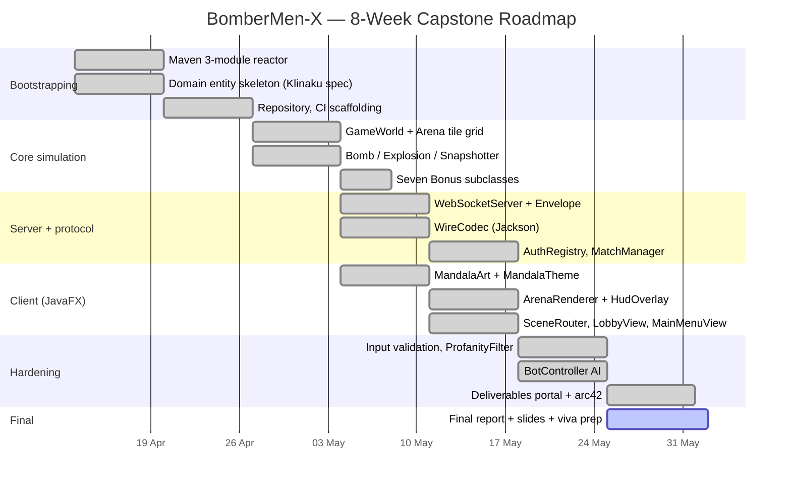

# BomberMen-X — Combined Plan (Descriptive + Prescriptive)

**Module:** Software Architecture & Design (SAD), M.Sc. Applied Computer Science
**Institution:** SRH University Stuttgart
**Supervisor:** Dr. Floriment Klinaku
**Date:** 28 May 2026 — Week 7 of 8 (Prototype submission)
**Final submission:** Tuesday, 02 June 2026 (Final report + presentation + viva)

---

## 1. Gantt overview (W1 – W8)

---

## 2. Descriptive plan — what shipped through W1 – W7

### W1 – W2 — Bootstrapping (13 Apr – 26 Apr 2026)

The first sprint was about laying a clean Maven foundation that would survive seven further weeks of additive work. **Abhilash (AA)** wrote the parent `pom.xml`, declared the three child modules (`bomberman-core`, `bomberman-server`, `bomberman-client`), pinned Java 17 and Jackson, and verified the reactor build on a portable Red Hat JDK 17 + Maven 3.9 install with no admin privileges. **Simranjot (SK)** sketched the first set of domain entities — `Bomberman`, `Player`, `Score`, `Bomb`, `Explosion`, `Tile`, `Arena` — using Lombok-free records and small mutable classes so they would be trivial to serialize. **Jithendra (JC)** seeded the server module with a Netty bootstrap, a placeholder WebSocket handshake, and a CI smoke script that ran `mvn clean install -DskipTests`. By end of W2 the reactor compiled, the artefact graph was clean, and the entity package matched Dr. Klinaku's domain whiteboard from the kick-off meeting.

### W3 – W4 — Core simulation (27 Apr – 10 May 2026)

The middle weeks delivered the deterministic game loop. SK drove `GameWorld`, `GameState`, `GameMode`, and the `Snapshotter` that turns mutable world state into immutable DTOs (`WorldSnapshot`, `PlayerSnapshot`, `BombSnapshot`, `ExplosionSnapshot`, `PickupSnapshot`). The arena was implemented as a fixed-size `Tile[][]` grid; `TileType` distinguishes Wall, Block, Floor, Spawn. AA refactored the seven concrete `Bonus` subclasses — `ArmorBonus`, `ExtraBombBonus`, `FlameBonus`, `KickBonus`, `LifeBonus`, `SpeedBonus`, `ThrowBonus` — into a clean inheritance tree under the abstract `Bonus` plus `PowerUpType` enum and a `PowerUpItem` adapter so the renderer can treat all pickups uniformly. JC wrote `BombServerApplication` as the entrypoint, with `GameServer` orchestrating Netty channels. The first `GameWorldTest` proved that ticking the world advances bomb fuses and explosion lifetimes correctly.

### W5 — Server + wire protocol (11 May – 17 May 2026)

JC delivered the production wire protocol: an `Envelope` record with a `MessageType` enum (24 message kinds covering auth, lobby, match, snapshot, chat, voice, haptics) carrying a Jackson-serialised payload. `WireCodec` is the single choke point through which all JSON crosses; `WireCodecTest` asserts round-trip equality for every DTO. `WebSocketServer` accepts ws:// on port 8080, `GameServerHandler` routes frames per `MessageType`, and `MetricsHandler` exposes a tiny Prometheus-style scrape page on port 9091. AA produced `AuthRegistry` plus the `AuthProvider` SPI with `DevAuthProvider` (offline UUIDs) and a stub `GoogleAuthProvider` ready for OAuth. The lobby subsystem (`LobbyService`, `LobbyPlayer`, `CosmeticsCatalog`) was added so players can equip skins before queueing into a `Match`.

### W5 – W6 — Client (JavaFX, 11 May – 24 May 2026)

SK led the JavaFX client. `ClientLauncher` is the JavaFX `Application`; `SceneRouter` swaps between `MainMenuView`, `LobbyView`, `ArenaView`, and `RankingsView`. `MandalaArt` and `MandalaTheme` apply the Indian-festival palette (teal #008080 / turmeric #ffc107 / henna #ec407a / gold #daa520 on aubergine #150a1f) consistently across the UI. `ArenaRenderer` paints the tile grid onto a `Canvas`; `HudOverlay` shows lives, bomb count, flame range, score. AA wired `GameClient` over `java.net.http.WebSocket`, with the same `WireCodec` used on the server, so DTO drift is structurally impossible.

### W6 – W7 — Hardening (18 May – 28 May 2026)

JC implemented `BotController` so empty match slots can be filled by AI opponents — useful for both demos and stress tests. AA added `ProfanityFilter` (covered by `ProfanityFilterTest`) and `AgeGate` on the client. `PostFx`, `CameraShake`, `ParticleSystem`, and `SpatialAudio` were sketched for v0.3 polish but kept stub-clean so they would not delay the prototype. SK assembled the deliverables portal under `deliverables/index.html` — 33+ HTML pages cross-linked, with the arc42 view in `architecture-report-en.html`, code-explanation docs under `code-explanation/`, and diagrams under `diagrams/` and `uml/`.

---

## 3. Sprint-by-sprint table

Legend: ✓ done · ⌛ in progress · • pending

| Sprint  | Window         | AA (Delivery / Arch)                  | SK (UI / Engine)                      | JC (Net / Ops)                        |
| ------- | -------------- | ------------------------------------- | ------------------------------------- | ------------------------------------- |
| W1      | 13 – 19 Apr    | ✓ Parent pom, modules, JDK pin        | ✓ Entity skeleton (12 classes)        | ✓ Netty bootstrap, CI script          |
| W2      | 20 – 26 Apr    | ✓ Bonus tree refactor                 | ✓ Tile / Arena / Direction / TilePos  | ✓ GameServer scaffold                 |
| W3      | 27 Apr – 03 May| ✓ Requirements traceability v1        | ✓ GameWorld / GameState / GameMode    | ✓ ServerConfig + env loader           |
| W4      | 04 – 10 May    | ✓ ArchSpec doc draft                  | ✓ Snapshotter + DTOs                  | ✓ MatchManager / Match / MatchSession |
| W5      | 11 – 17 May    | ✓ AuthRegistry + ProviderSPI          | ✓ MandalaTheme + MainMenuView         | ✓ WebSocketServer + Envelope + WireCodec |
| W6      | 18 – 24 May    | ✓ ProfanityFilter + tests             | ✓ ArenaRenderer + HudOverlay          | ✓ BotController + ChatRouter          |
| W7      | 25 – 28 May    | ✓ Deliverables portal, arc42, plans   | ✓ LobbyView, RankingsView, SceneRouter| ✓ MetricsHandler + Docker images      |
| W8 plan | 29 May – 02 Jun| ⌛ Final report polish, requirements matrix, viva script | ⌛ Demo capture, screenshots, slides polish | ⌛ Compose smoke run, deploy walkthrough, Q&A prep |

---

## 4. Prescriptive plan — W8 and beyond

### Week 8 (29 May – 02 June 2026)

Week 8 is non-negotiable. The deliverable on Tuesday 02 June 2026 is the **final architecture report (PDF + DOCX)**, the **slide deck**, and a **15-minute viva** with Dr. Klinaku.

**Thursday 29 May 2026** — AA freezes the architecture report HTML (`deliverables/architecture-report-en.html`), exports DOCX and PDF into `deliverables/exports/`. SK records a 90-second screen capture of a local match (server + two clients + one bot). JC runs `docker compose -f infra/docker-compose.yml up` end-to-end on a clean machine and pastes the log into `deliverables/build/`.

**Friday 30 May 2026** — Rehearsal 1. All three architects walk the slide deck and read the report aloud. AA owns the executive summary, building-blocks view, and ADRs. SK owns the runtime view, UI walkthrough, and quality attributes. JC owns the deployment view, wire protocol, and risk slide.

**Saturday 31 May 2026** — Buffer. Bug-fix only; no new features. Any open issue in the GitHub mirror that is not labelled `viva-blocker` is deferred to v0.3.

**Sunday 01 June 2026** — Rehearsal 2 with a stopwatch. Target is 12 minutes presentation + 3 minutes Q&A. AA pre-loads the answers to the seven anticipated viva questions captured in `deliverables/plans/viva-prep.md` (sister document).

**Tuesday 02 June 2026** — Submission day. Upload PDF + DOCX + slides + repo link to the SRH submission portal by 09:00. Viva at the assigned slot. Push the final tagged release to the GitHub mirror after the viva.

### Post-submission (v0.3, June – July 2026)

If the prototype passes, the team intends to harden BomberMen-X into a publishable v0.3:

- **Persistence layer.** PostgreSQL behind a `RankingsRepository` interface. Today rankings live in memory.
- **3D spectator view.** A JavaFX 3D `SubScene` that consumes the same `WorldSnapshot` stream. Deliberately deferred because it adds graphics-pipeline risk without changing the underlying architecture.
- **Full anti-cheat.** Server-side input validation already rejects impossible moves; v0.3 adds a rolling-window plausibility check and a kick policy.
- **OAuth integration.** `GoogleAuthProvider` is stubbed; v0.3 wires real OIDC.
- **Cloud Run deployment.** `Dockerfile.server` already builds a slim runtime image. v0.3 publishes it to Artifact Registry and deploys to Google Cloud Run with a managed certificate.

---

## 5. Where we are on 28 May 2026

### What works today

- `mvn clean test` is green across all three modules. Three tests pass: `WireCodecTest`, `GameWorldTest`, `ProfanityFilterTest`.
- Server boots on `ws://localhost:8080`, metrics on `http://localhost:9091`.
- JavaFX client connects, walks through `MainMenuView` → `LobbyView` → `ArenaView`, and renders a live `WorldSnapshot` stream.
- `BotController` fills empty slots — a single human plus one bot is sufficient for a credible demo.
- `infra/docker-compose.yml` brings up the server in a container.
- `deliverables/` portal is published locally and mirrored to `https://abhilashanuku.github.io/bombermenx/`.

### What is deferred (and acknowledged)

- **3D spectator view.** Stubbed only. The 2D `ArenaRenderer` is the demonstrable surface.
- **Persistence.** Rankings are in-memory; `LobbyService` resets on server restart.
- **Audio.** `AudioBus` and `SpatialAudio` compile but the sample bank is not bundled. Demo runs muted.
- **OAuth.** Dev provider only.

These deferrals are deliberate — they preserve the prototype scope agreed with Dr. Klinaku at the W3 review.

---

## 6. Risks for week 8

| Risk                                             | Likelihood | Impact | Owner | Mitigation                                                                 |
| ------------------------------------------------ | ---------- | ------ | ----- | -------------------------------------------------------------------------- |
| Demo machine has no JDK 17                       | Low        | High   | JC    | Bring a USB with portable JDK + Maven; pre-run `mvn package` at 08:00.     |
| JavaFX module-path failure on submission laptop  | Medium     | High   | SK    | Ship a fat-jar built with shaded JavaFX; verified on Friday 30 May.        |
| Port 8080 blocked by SRH network                 | Medium     | Medium | JC    | Fall back to `--port=18080` flag in `BombServerApplication`; tested.       |
| Live coding question from Dr. Klinaku            | Medium     | Medium | AA    | All three architects rehearse the entity tree and the `WireCodec` path.    |
| Slide deck overruns 15 min                       | Medium     | Medium | AA    | Friday + Sunday rehearsals with stopwatch; cut slide 9 if needed.          |
| Last-minute Maven dependency download failure    | Low        | High   | AA    | Pre-populate `~/.m2/repository` on the demo laptop on Sunday 01 June.      |

The plan accepts that Week 8 produces **no new code** — only documentation polish, rehearsal, and submission. This conservative posture is what the W3 review committed to and is what gets the prototype across the line on 02 June 2026.

---

## 7. Definition of done for 02 June 2026

A submission is "done" when, and only when, every item below is checked:

- [ ] `mvn clean test` green on a fresh clone of the repository.
- [ ] `docker compose -f infra/docker-compose.yml up` brings up server + reachable metrics page.
- [ ] JavaFX client connects to the local server and plays one round with one bot.
- [ ] `deliverables/architecture-report-en.html` opens without console errors and links resolve.
- [ ] `deliverables/exports/` contains PDF + DOCX of the report.
- [ ] `deliverables/presentation/slides.html` renders all 14 slides with arrow-key navigation.
- [ ] Slides rehearsed end-to-end inside 12 minutes.
- [ ] Repository tagged `v0.2.0-prototype` after the viva.

The three architects sign off jointly. The plan is intentionally conservative — Week 7 has already produced everything load-bearing; Week 8 is rehearsal and polish.
